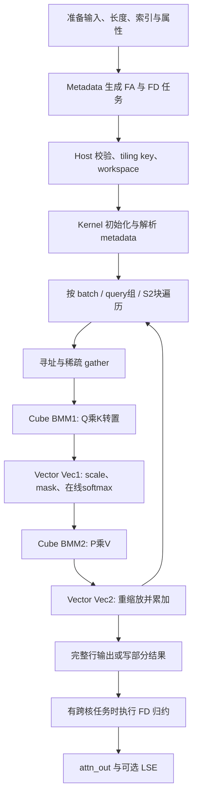

# SparseFlashMla 算子设计与开发指南

本文面向第一次接触该算子的开发者，按“计算什么 → 怎样分工 → 数据放在哪里 → 怎样执行 → 怎样验证”的顺序介绍当前仓库实现。范围为 `attention/sparse_flash_mla`，并追踪配套 `sparse_flash_mla_metadata` 的任务切分。文中数值来自当前源码，不是适用于所有 MLA 算子的通用参数。

建议先读第 1～3 节建立概念，再结合第 4～6 节读 Kernel。接口完整约束见 [README](../README.md) 和 [aclnn 接口说明](aclnnSparseFlashMla.md)。本文区分公开接口约束与内部模板分支；存在模板不代表任意输入组合都能通过校验。

A2/A3 倍率 1/2 的具体改动与验证范围见 [cmp_ratio=1/2 适配说明](ratio2_a2a3.md)。当前 A2/A3 的 SWA 接受 0，CSA 接受 1/2/4，HCA 接受 128；cmp causal mask 下倍率不为 1 时必须提供 residual（包括余数为 0 的情况）。

## 1. 算子计算什么

### 1.1 MLA、稀疏选择和融合计算

本实现的 Q 和 KV 的最后一维都是 `D=512`，KV 由 448 维 nope 与 64 维 rope 拼接组成；KV head 数 `N2=1`。每个 query head 对选出的 KV 计算注意力，**同一份 KV 同时作为 K 和 V，输出也是 512 维**。不要把其他 MLA 实现中“仅部分维度作为 V”的规则套到这里。

设 query head 数为 `N1`，分组比 `G=N1/N2`。给定 batch `b`、query token `i`、query head `h`，令 `J(b,i)` 为实际参与计算的 KV 条目序列，条目可以来自原始缓存 `ori_kv` 或压缩缓存 `cmp_kv`。对有效条目：

\[
x_j=\text{softmax\_scale}\sum_{d=0}^{511}Q_{b,i,h,d}KV_{j,d}.
\]

本实现还包含每个 head 的 `sinks[h]`。记它为 \(s_h\)，完整计算为：

\[
Z=e^{s_h}+\sum_{j\in J(b,i)}e^{x_j},\qquad
O_d=\frac{\sum_{j\in J(b,i)}e^{x_j}KV_{j,d}}{Z},\qquad
LSE=\log Z.
\]

`sinks` 相当于一个 value 为零的额外 softmax 项：影响分母，不增加输出分子。它不是 KV cache 中的一个 token，也不是窗口左端保留的 token。当前 Host 的 `GetSinks` 会检查 sinks 是否存在，不能因为接口表将其标为可选，就直接省略。

算子不负责生成压缩 KV，也不负责从全量 KV 计算 TopK 排名；调用方提供压缩结果及稀疏索引。融合的核心是按小块完成 `QKᵀ → mask/softmax → PV → 累加`，避免存储完整注意力矩阵。

公式与精度参考：[Golden](../tests/pytest/sparse_flash_mla_golden.py) 的 `calculate_by_bnsd`、`sinks_softmax`；输出 shape 参考 [InferShape](../op_host/sparse_flash_mla_infershape.cpp)。

### 1.2 场景与模板路由

| 输入形态 | 算法含义 | arch22 路由 | arch35 路由 |
| --- | --- | --- | --- |
| ori KV，无稀疏索引 | SWA，按窗口或 mask 访问 ori | SWA Kernel | SWA Kernel |
| ori KV + ori 索引 + ori 有效 TopK 长度 | 稀疏 ori | SWA 模板 + `hasOriSparseIndices` | `ORI_SPARSE`，CSA Kernel |
| ori KV + cmp KV + cmp 索引 | CSA，ori 与稀疏 cmp 共同归一化 | CSA Kernel | CSA Kernel |
| ori KV + cmp KV，无 cmp 索引 | HCA，ori 与连续压缩 KV 共同归一化 | SWA Kernel | SWA Kernel |
| ori/cmp 均带索引 | 内部 `ORI_CMP_SPARSE` 分支 | 不应据此推断支持 | CSA Kernel，仍须通过 checker |

“CSA Kernel”是复用的执行框架名，不意味着只处理传统 CSA。HCA 也没有独立的 `hca_kernel.h`。真实选择过程见 [Host](../op_host/sparse_flash_mla_tiling.cpp) 的 `GetSMLATemplateMode` 和 [Kernel 入口](../op_kernel/sparse_flash_mla.cpp)。

平台对应：A2/A3 使用 `DAV_2201` 的 Host 逻辑和 `arch22`；950 路径使用 `DAV_3510` 与 `arch35`，Kernel 编译入口以 `__CCE_AICORE__ == 310` 区分。文件夹名、Host 架构枚举和编译宏不是同一个编号体系。

## 2. 输入、布局与寻址

### 2.1 维度约定

| 符号 | 含义 |
| --- | --- |
| B | batch 数 |
| S1 | 单 batch 的 Q 序列长度；Host 中 TND 的 `s1Size` 可表示总 Q token 数 |
| S2 / cmpS2 | ori / cmp 序列长度，计算时再按有效长度、mask、索引收缩 |
| T | TND 的所有 batch token 总数 |
| N1 / N2 / G | Q head 数 / KV head 数 / 每个 KV head 对应的 Q head 数 |
| M | 矩阵乘的行，来自 query token 与 G 的合轴，不一定等于 query token 数 |
| Ktop | 稀疏索引张量末维容量，与矩阵乘的归约维 D 无关 |

Q 支持 `[B,S1,N1,D]`（BSND）、`[T,N1,D]`（TND）；KV 支持 BSND、TND、`[block_num,block_size,N2,D]`（PA_BBND）。非分页时 Q/KV 布局必须匹配；分页时 Q 可为 BSND 或 TND。

`attn_out` shape 和 dtype 与 Q 相同。开启 LSE 时，BSND 输出 LSE 为 `[B,N2,S1,G]`，TND 为 `[N2,T,G]`，dtype 为 FP32；关闭时为 shape `[0]` 的占位输出。LSE 不能简单按 Q 去掉最后一维来解释。

### 2.2 分清存储长度、有效长度和坐标

`cu_seqlens_*` 是前缀和，TND 中 batch `b` 的存储起点为 `cu[b]`，存储长度为 `cu[b+1]-cu[b]`。`seqused_*` 描述实际参与运算的长度，存在时用于收缩有效区间，不应拿它代替 TND 的存储起点。BSND 则仍按固定 shape/stride 找 batch 起点。

压缩侧 mask 需要原始时间轴。显式 `cmp_residual_kv` 用于恢复：

\[
L_{\text{cmp,original}}=L_{\text{cmp,valid}}\times\text{cmp\_ratio}+\text{residual}.
\]

未显式提供长度或 residual 时，各布局有自己的推导分支，应追踪 `ComputeParamBatch` 和 Golden 的长度解析，不能总用 ori 长度替代 cmp 的时间轴。

### 2.3 稀疏索引与分页是两层映射

稀疏索引决定“取哪个逻辑 token”；block table 决定“逻辑 token 存在哪个物理页”。例如 PA block size 为 16，某索引为 35，则逻辑页号为 2、页内偏移为 3。若 `block_table[b,2]=7`，实际读取物理页 7 的第 3 个 token。

对于连续存储、N2=1 的 PA KV，元素偏移可以写成：

```text
page = logical_token / block_size
offset_in_page = logical_token % block_size
physical_page = block_table[b, page]
element_offset = (physical_page * block_size + offset_in_page) * D + d
```

上式是连续存储示例。源码还传递 `oriKvStride0`、`cmpKvStride0`、`oriKeyStride0` 等 stride，扩展非连续输入时必须按实际 stride 计算。ori/cmp 的 block size、block table 和长度各自独立。

稀疏 ori 的索引 shape 为 `[B,S1,N2,Ktop]` 或 `[T,N2,Ktop]`，`ori_topk_length` 给每个 query/KV head 的有效条目数，范围 `[0,Ktop]`；有效条目左对齐，尾部建议填 `-1`。索引有效性检查、长度裁剪和 mask 都不能因 gather 已经完成而省略。`cmp_topk_length` 在公开接口中仍是预留输入，不可仅根据 Kernel 的参数名认定可以传入。

### 2.4 mask 如何影响选中条目

原始侧右下对齐的 query 位置为 `p=Lori-Lq+i`。mode 3 保留 `j<=p`；mode 4 的有限窗口保留 `p-win_left<=j<=p+win_right`，再与 `[0,Lori)` 相交；mode 0 不施加窗口 mask。`-1` 无界窗口仅适用于支持它的平台/模式。

压缩侧 mode 3 按压缩比例与恢复的原始长度判断可见范围，不能直接拿压缩 token 编号和 Q 编号比较。边界、索引裁剪的完整实现应对照 [KV 参数工具](../op_kernel/arch35/sparse_flash_mla_kvcache.h) 和 Golden。A2/A3 与 950 的 mask、head 数、block size、压缩比支持范围不同，以 README 和相应 checker 为准。

## 3. Tiling：三层分工

### 3.1 Host tiling 决定静态配置

`TilingForSparseFlashMla` 的顺序是：

1. `SMLAInfoParser::Parse` 解析平台、shape、dtype、layout、stride、可选输入及模式。
2. arch22 走 `SMLATilingCheck`；其他分支走独立的 `SparseFlashMlaChecker`。
3. `DoOpTiling` 设置 blockDim，计算基本块和 workspace，写入 tiling data 和 tiling key。

`blockDim` 通过平台的 `CalcTschBlockDim` 计算，不是写死 36。Host 的 `usedCoreNum` 记录可用 AIC 数；实际哪些核有任务由 metadata 的 enable 字段决定。

主要 tiling 字段：

| 字段组 | 作用 |
| --- | --- |
| `batchSize/qSeqSize/kvSeqSize/nNumOfQInOneGroup` | batch、序列和 head 分组参数 |
| `mBaseSize/s2BaseSize/mmResUbSize/bmm2ResUbSize` | Host 基本块和中间结果容量，后两项单位是元素数 |
| layout、stride、各侧 block size/table 宽度 | 将逻辑坐标转换为地址 |
| mask、window、scale、returnSoftmaxLse | 数值语义及输出控制 |
| ori/cmp sparse count、index width、有效长度维度 | 稀疏和变长输入解析 |

### 3.2 基本块与架构差异

令 `align(x,a)=ceil(x/a)*a`。Host `SplitBalanced` 的计算如下：

| 分支 | Host M 基本块 | Host S2 基本块 |
| --- | --- | --- |
| arch22 CSA | G | 512 |
| arch22 连续 SWA/HCA | `floor(256/G)*G` | 512 |
| arch22 稀疏 ori | G，即一个 query token 的 heads | 512 |
| arch35 | 默认 64 | 默认 512 |

Host 还计算：

```text
Mcap = min(G * host_s1Size, mBaseSize)
R1 = align(s2BaseSize,32) * align(Mcap,16)    # mmResUbSize，元素数
R2 = align(D,32) * align(Mcap,16)             # bmm2ResUbSize，元素数
```

**arch35 Kernel 在 Init 中明确设置 `s1BaseSize=64`、`s2BaseSize=128`。** 其本地矩阵缓冲区按这个实际块配置建立，不能用 Host 的 512 来计算 UB/L1 大小。配套 Metadata 在 arch35 以 `mBaseSize=G`、S2=128 组织逻辑任务，表示每个 query token 的一组 heads；64 是单 AIC 的矩阵行容量。

arch35 在 `G>64` 时开启 `SPLIT_G`：一对 AIC 处理相同 query 的两部分 heads，第一个处理 `ceil(G/2)`，第二个处理剩余 heads，共享 KV gather 缓存。因而逻辑任务槽数由 AIC 数 C 降为 `C/2`。这是切 head；沿 S2 切分再归约是另一件事。

### 3.3 Metadata 决定实际任务区间

调用链：`SparseFlashMlaMetadata → metadata Tensor → SparseFlashMla`。前置算子使用实际长度、窗口、稀疏容量等构建任务，主算子不能只凭 Q/KV shape 还原这些任务。

[Metadata 实现](../../sparse_flash_mla_metadata/op_kernel_aicpu/sparse_flash_mla_metadata_aicpu.cpp) 的 `BalanceSchedule` 依次执行：`CalcSplitInfo → CalcCostInfo → CalcSplitPlan → SplitFD → GenMetadata`。分配内部包含按 batch、按行、按 S2 block 分配的路径；使用 ori/cmp 成本及尾块信息，而非简单平均分 batch。必要时一行的 S2 工作跨多个核，产生 FD（Flash Decode）归约任务。

metadata 为固定 `[1024]` 的 INT32 Tensor，即 4096 字节。当前协议容纳 36 组 FA 记录和 72 组 FD 记录，实际占用 `36*9+72*8=900` 个元素，剩余空间不应自行定义用途。

| 区域 | 单条元素数 | 内容 |
| --- | --- | --- |
| FA，按 AIC | 9 | enable；起止 BN2/M/S2 游标；首个 FD workspace 索引；S2 最大轮次 |
| FD，按 AIV | 8 | enable；BN2/M；workspace 起点与份数；归约 M 起点与行数；预留位置 |

FA 元素地址为 `core*9+field`，FD 为 `36*9+core*8+field`，见 [协议头](../op_kernel/sparse_flash_mla_kernel_metadata.h)。M/S2 是协议游标，S2 经 `ConvertS2MetadataBlockToToken`、`ApplyS2MetadataRange` 转换和裁剪，不能把原始字段直接当 GM token 偏移。

### 3.4 Tiling key 和一致性模式

key 模板维度为 `FLASH_DECODE, Q_LAYOUT, KV_LAYOUT, TEMPLATE_MODE, SPLIT_G, HEAD_RATIO_ONE, BATCH_CONSISTENCY, IS_VEC_S2PHYADDR`。当前 Host 第一个参数传 0；这不代表执行过程中不存在 FD，arch35 的 FD 任务由 metadata 驱动。`HEAD_RATIO_ONE` 为 arch22 CSA 且 G=1 的特化。

batch consistency 来自执行上下文的 deterministic level。arch35 按每行实际负载形成稳定 reduction block：以 `floor(totalLoad/32)` 向上对齐到 S2 基本块，至少一个基本块；先在核内归约，再按协议做跨核归约。其目的在于稳定 batch 变化时的浮点累加顺序，不能理解成只设置一个随机种子。它需要专门的 workspace，且不能据此承诺跨架构、跨 dtype 逐位一致。

## 4. 内存分配与生命周期

### 4.1 内存层级

| 位置 | 保存内容 | 主要使用者 |
| --- | --- | --- |
| GM | 输入/输出、metadata、跨阶段或跨核 workspace | 所有核 |
| L1 | Q、K/V、softmax 权重 P 的矩阵输入块 | Cube，部分数据由 Vector 写入 |
| L0A/L0B | 当前矩阵乘操作数 | Cube |
| L0C | FP32 矩阵乘累加结果 | Cube/Fixpipe |
| UB | gather、mask、softmax 状态、输出累加 | Vector |

FP16/BF16 输入和 P 占 2 字节；矩阵结果、max/sum 和累加输出通常采用 FP32，占 4 字节。后面的 KiB 均为 1024 字节。

workspace 总量由 Host 申请；Kernel 入口用 `GetUserWorkspace` 去掉框架工作区前缀，再按内部偏移切片。不能将 Host 的库工作区大小再重复加到 user 指针上。

### 4.2 arch22 的 GM workspace

令 C 为 AIC 数，R1/R2 为第 3.2 节的元素数。`DoOpTiling` 为每核两套流水槽分配：

| 区域 | 字节数 | 数据流 |
| --- | --- | --- |
| MM1 结果 | `2*R1*4*C` | Cube → Vector，QK 分数 |
| Vec1 结果 | `2*R1*2*C` | Vector → Cube，softmax 权重 |
| MM2 结果 | `2*R2*4*C` | Cube → Vector，PV |
| Vec2 结果 | `2*R2*4*C` | 分块累加结果暂存 |
| KV merge，仅 CSA/稀疏 ori | `3*512*512*2*C` | 三槽 gather 缓存 |

所以此路径用户工作区为 `C*(12*R1+16*R2)`，再按需加 KV merge；框架库工作区另加。源码里的容量字段虽然包含 `Ub`，这里是用于计算 GM 中间结果预留量，不能当成单个 UB 分配。

例如 arch22 CSA、G=32、D=512，R1=R2=16384，四类结果每核共 448 KiB，KV merge 每核 1536 KiB，合计 1984 KiB；再乘实际 C。此例只计算该分支的 workspace，不包含 Q/KV/输出和库工作区。

### 4.3 arch22 的片上缓冲区（CSA 路径）

[Cube `InitBuffers`](../op_kernel/arch22/sparse_flash_mla_csa_block_cube.h) 中 `L1_BLOCK_SIZE=64*512*2=64 KiB`：Q/P L1 分配 4 块即 256 KiB，KV L1 分配 3 块即 192 KiB；L0A/L0B 各双缓冲共 64 KiB，L0C 双缓冲共 128 KiB。

[Vector `InitBuffers`](../op_kernel/arch22/sparse_flash_mla_csa_block_vector.h) 包含：inputBuff1 64 KiB、inputBuff2 32 KiB、outputBuff1 32 KiB、tmpBuff1 32 KiB、有效长度缓冲 8 KiB；另有 max/exp/sum 流水状态、默认状态、sinks 与广播缓冲，LSE 开启时加输出缓冲。部分逻辑 Tensor 是对已有缓冲的视图，不应对每个 Tensor 名重复计费。SWA 有独立的 Cube/Vector 类，应分别检查，不能将 CSA 预算无条件套用。

### 4.4 arch35 的 GM workspace

定义逻辑槽数 `L=C`，split-G 时 `L=C/2`；AIV 数为 V。Host 申请量分三部分：

1. 当 split-G 或 CSA/ORI_SPARSE/ORI_CMP_SPARSE 时，KV gather 三槽为 `3*128*512*2*L` 字节；有效索引辅助区预留 `3*128*4*V` 字节。
2. 若启用物理地址向量化，增加选中侧的地址表：`totalQ*align(Ktop,128)*8` 字节/侧，`totalQ` 为 BSND 的 `B*S1` 或 TND 的 T。
3. FD staging：每槽 `F=G*4*(align(D,32)+2*8)` 字节，保存部分输出和广播布局的 max/sum。普通模式预留 `2*L*F`；batch consistency 模式预留 `(2*L+C*33)*F`。

物理地址向量化并非所有 PA case 都开启：Host 估算索引、INT64 地址和 block table 所需 UB，要求不超过 184 KiB；PA 还要求涉及的 block size 满足二次幂条件，且模板属于支持的稀疏路径。失败则回落到非向量化路径。

这里列的是 **Host 的申请公式**。Kernel 的 `InitMMResBuf`、`GetKVPhyAddr` 使用 `GetBlockNum()` 等计算各区域偏移，不应仅凭 Host 的预留总量反推每个内部区域起点；特别是辅助索引区的 Host 预留可能大于设备实际布局。修改时要逐区验证设备最大访问地址不超过申请量。

### 4.5 arch35 的片上静态布局

[CSA Kernel `InitMMResBuf`](../op_kernel/arch35/sparse_flash_mla_csa_kernel_arch35.h) 中：

```text
每 AIC 的 L1： [P槽0 16KiB][P槽1 16KiB][Cube侧Q/KV区...]
每 AIV 的 UB： [BMM2 64KiB][BMM1槽0 16KiB][BMM1槽1 16KiB][Vector私有区...]
```

P 每槽 `64*128*2=16 KiB`；每 AIV 负责半个 M 块，所以 BMM1 每槽 `32*128*4=16 KiB`，BMM2 为 `32*512*4=64 KiB`。P 必须位于 L1 前部且 Vector/Cube 地址一致。

[Cube 缓冲](../op_kernel/arch35/sparse_flash_mla_csa_block_cube_arch35.h) 使用三槽 Q、三槽 KV，以及双槽 L0A/B/C。单槽常量见 [arch35 common](../op_kernel/arch35/sparse_flash_mla_common_arch35.h)：Q 32 KiB、KV 128 KiB、L0A 16 KiB、L0B 32 KiB、L0C 128 KiB。L1 中连同 P 共 `32+3*32+3*128=512 KiB`。

[Vector `InitLocalBuffer`](../op_kernel/arch35/sparse_flash_mla_csa_block_vector_arch35.h) 在上述 96 KiB UB 后继续排布：

| 对象 | 大小 |
| --- | --- |
| softmax sum/max/exp，各双槽 | 合计 `6*256=1536` 字节 |
| common / sinks | 各 512 字节 |
| 稀疏 gather stage0，双槽 | `2*16*512*2=32 KiB` |
| LSE，按需双槽 | 512 字节 |
| stage1 P 输出，双槽 | `2*33*128*2=16896` 字节，stride 为 33 |
| stage2 FP32 输出 | `32*512*4=64 KiB` |
| batch consistency 附加状态 | `4*256+768*4=4096` 字节 |

因此稀疏路径、开启 LSE、关闭 batch consistency 时，该静态主流程布局合计 216576 字节；开启一致性时为 220672 字节。地址向量化和 FD 有各自的执行相位/缓冲布局，不能将不同相位占用机械相加。无稀疏 gather 的 SWA 路径也不分配 stage0 双槽。

### 4.6 为什么需要双缓冲和三缓冲

双缓冲让一个槽被消费时，另一个槽可以写入；三槽 KV 则覆盖 gather、加载和矩阵消费之间更长的流水距离。复用的前提是“旧消费者已结束”，并不只是 `taskId%2` 或 `%3` 算对。

arch35 使用 `CROSSCORE_V0RES`、`CROSSCORE_BMM1`、`CROSSCORE_L1P`、`CROSSCORE_BMM2` 等跨核 flag，以及 `INNERCORE_*` 的 MTE/Vector/Cube 事件。flag 绑定资源就绪/释放关系，修改循环、提前 return、跳过空任务时必须保持生产与消费配对。split-G 中无计算任务的核也可能仍需参加同步，不能直接删除其补齐循环。

## 5. 算子计算流

### 5.1 总体流程



图中循环是逻辑依赖；真实实现将不同 S2 块的阶段重叠执行。

### 5.2 一个计算块内部的职责

| 阶段 | 执行单元 | 输入 → 输出 |
| --- | --- | --- |
| 参数计算 | 标量逻辑 | metadata、长度、mask → batch/query/S2 范围与尾块 |
| Vec0 | Vector，稀疏路径 | 索引、block table、KV → 连续 KV 小块与有效性信息 |
| LoadQK | Cube 搬运流水 | Q、gather/连续 KV → L1/L0 |
| BMM1 | Cube | `[M,D] * [D,N] → [M,N]` FP32 分数 |
| Vec1 | Vector | 分数 → 缩放、mask、max/sum、低精度 P |
| BMM2 | Cube | `[M,N] * [N,D] → [M,D]` FP32 块结果 |
| Vec2 | Vector | 新块结果、旧累加值、指数修正 → 更新后的输出状态 |
| FD | Vector，按 metadata | 部分输出/max/sum → 最终归一化输出 |

连续 SWA/HCA 可直接读取连续或分页 KV，少掉通用稀疏 gather 阶段。ori 与 cmp 可以分多轮读取，但必须共享同一行的 softmax 状态；分别 softmax 后直接相加不等价。

### 5.3 在线 softmax 的正确递推

以一行解释。保存行最大值 m、指数和 l、未归一化输出向量 a。若在此处一次性计入有限 sink，可初始化 `m=sink, l=1, a=0`。对当前 KV 块的有效 logits x：

\[
m'=\max(m,\max_j x_j),\quad \alpha=e^{m-m'},\quad p_j=e^{x_j-m'},
\]
\[
l'=\alpha l+\sum_jp_j,\qquad a'=\alpha a+\sum_jp_jV_j.
\]

所有块结束后 `O=a/l`、`LSE=m+log(l)`。m 变大时旧累加量必须乘 alpha，否则结果错误。实现用 FP32 管理状态，但 P 在送入第二次矩阵乘时会转换为输入精度；Golden 也显式模拟这一转换，所以不能期望与全 FP32 dense attention 完全一致。

无效索引或 mask 掉的条目必须对指数和贡献零。空行、全 mask、全空 batch 的输出有专门初始化/跳过分支；特别是 LSE 的空行写出规则要按实际分支与 Golden 核对，不可直接执行可能产生 NaN 的 `-inf-(-inf)`。

### 5.4 arch35 CSA 的流水时序

`ProcessMainLoop` 使用 `RunInfo[4]` 保存不同在途任务。稳定阶段，以当前计数 t 表示：

| 逻辑任务 | 本轮推进的阶段 |
| --- | --- |
| t | Vec0 gather |
| t-1 | Cube LoadQK |
| t-2 | Cube BMM1，随后 Vector Vec1 |
| t-3 | Cube BMM2，随后 Vector Vec2 |

同一任务的 BMM1/Vec1、BMM2/Vec2 通过 flag 保证先后，表格不表示它们同时读写同一块数据。Q/KV 三槽、BMM1/P 双槽与 RunInfo 四槽承担不同生命周期，不能统一改成一个取模值。

末尾还要执行排空轮次，让最后几块走完 Vec1/BMM2/Vec2。`notLastThreeLoop`、`notLastTwoLoop`、`notLast` 正是控制预热和排空。只遍历“真实 S2 块数”而删除排空，会漏写尾部结果。

### 5.5 跨核 S2 归约

若一行被切到多个核，每份结果带有局部 \((m_r,l_r,a_r)\)。合并公式为：

\[
m=\max_r m_r,\quad l=\sum_r e^{m_r-m}l_r,\quad
a=\sum_r e^{m_r-m}a_r,\quad O=a/l.
\]

若 staging 保存的是局部已归一化输出 \(O_r\)，则输出权重必须为 \(e^{m_r-m}l_r\)，不能平均各核输出。sink 只能在整行中计入一次；修改分块或 FD 时必须检查其初始化和合并位置。

arch35 主循环完成后，AIV 经同步再按 FD metadata 执行 `ProcessFlashDecode`；相关 staging、归约辅助代码见 [Vector](../op_kernel/arch35/sparse_flash_mla_csa_block_vector_arch35.h) 和 [flash_decode](../op_kernel/arch35/common/flash_decode.h)。

## 6. 用一个例子串起来

选择 arch35 CSA，BSND，`B=1,S1=1,G=32,D=512`。假设经 mask/有效长度裁剪后有 128 个 ori 条目、512 个有效 cmp 索引条目，且这个 query 未跨核拆分。

1. Metadata 组织一个 query 组，ori 为一个 S2 块，cmp 为四个 S2 块；共五块，每块 128 条。该例的单核分配是说明条件，不是任意设备上的调度保证。
2. 此 query 的 Q 矩阵逻辑 shape 为 `[32,512]`。基本容量仍按 64 行分配，尾行由运行参数控制。
3. 每个 S2 块形成 `[128,512]` KV；cmp 块先按索引 gather。BMM1 有效结果为 `[32,128]`。
4. Vec1 对五块维护同一份 softmax 状态，Vec2 对五份 `[32,512]` 结果做指数修正累加。
5. 最后归一化输出 `[1,1,32,512]`；开启 LSE 时输出 `[1,1,1,32]`。

如果 Metadata 把同一行 S2 划给两核，两核改为写局部状态，最后走 FD。若 G 改为 128，arch35 还会启用 split-G，一对 AIC 各处理 64 个 heads；head 切分本身不需要把两个不同 head 的输出相加。

## 7. 代码阅读顺序与修改入口

| 阅读顺序 | 文件/符号 | 需要回答的问题 |
| --- | --- | --- |
| 1 | [README](../README.md)、[InferShape](../op_host/sparse_flash_mla_infershape.cpp) | 支持哪些输入，输出如何排列？ |
| 2 | [Golden](../tests/pytest/sparse_flash_mla_golden.py) | 选择、mask、sink、LSE 的数学语义是什么？ |
| 3 | [Host tiling](../op_host/sparse_flash_mla_tiling.cpp)、[tiling 结构](../op_host/sparse_flash_mla_tiling.h) | 哪个分支，哪些字段和 workspace？ |
| 4 | [Metadata](../../sparse_flash_mla_metadata/op_kernel_aicpu/sparse_flash_mla_metadata_aicpu.cpp) | 任务游标、负载和 FD 如何生成？ |
| 5 | [Kernel 入口](../op_kernel/sparse_flash_mla.cpp) | 实际实例化哪个模板？ |
| 6 | [arch35 CSA](../op_kernel/arch35/sparse_flash_mla_csa_kernel_arch35.h)、[SWA](../op_kernel/arch35/sparse_flash_mla_swa_kernel_arch35.h) | Init/ProcessMainLoop 如何调度？ |
| 7 | [arch22 CSA](../op_kernel/arch22/sparse_flash_mla_csa_kernel.h)、[SWA](../op_kernel/arch22/sparse_flash_mla_swa_kernel.h) | GM 中转与旧架构流水有何差异？ |
| 8 | 对应 block_cube、block_vector、kvcache | 每次搬运、矩阵乘、mask 和同步具体做什么？ |

增加布局要同时检查 shape/stride 校验、Metadata 长度解析、寻址和输出布局。增加 mask 要同时修改 Metadata 负载估计与 Kernel 可见范围，避免任务遗漏。改变基本块要同时检查 Host workspace、Metadata block 单位、本地静态布局、尾块和同步轮次。增加可选输入还要同步算子注册、Torch 绑定、参数索引及测试；不能只在 Kernel 函数中追加参数。

## 8. 验证与故障定位

### 8.1 建议的验证范围

| 类别 | 最小覆盖重点 |
| --- | --- |
| Host UT | dtype/shape/layout、缺失输入、无效属性、tiling key、workspace；分别覆盖 arch22/35 |
| 数值 | SWA、稀疏 ori、CSA、HCA；FP16/BF16；sink 与 LSE 开关 |
| 尾块 | S2 在基本块边界前后；小 G、G=64、G>64；950 的非偶数 G |
| 变长 | TND 前缀和，seqused 小于存储长度，空有效行，不同 batch 长度 |
| 稀疏/分页 | TopK 长度为 0/容量值，尾部 -1，跨物理页，不同 ori/cmp block size |
| 压缩 mask | cmp ratio、显式 cmp 长度与 residual，右下因果边界 |
| 调度 | 行内 S2 跨核、split-G、空闲核、流水排空 |
| 一致性 | 单样本与拼 batch/重排 batch；普通模式与 batch consistency；aclgraph |

已有 [Host UT](../tests/ut/op_host/test_sparse_flash_mla_tiling.cpp)、[arch35 UT](../tests/ut/op_host/arch35/test_sparse_flash_mla_tiling.cpp)、[单跑测试](../tests/pytest/test_sparse_flash_mla_single.py)、[batch consistency 测试](../tests/pytest/test_sparse_flash_mla_batch_consistency.py) 可作为起点。Golden 比较应同时检查输出与 LSE，并沿用仓库比较方法，避免随意放宽阈值掩盖边界错误。

在安装了匹配 CANN、torch_npu 和本仓库扩展的 Ascend 环境中，可从测试目录使用已有脚本：

```bash
cd attention/sparse_flash_mla/tests/pytest
bash test_run.sh --help
bash test_run.sh single
bash test_run.sh single --batch-consistency on
```

用例参数来自相应 paramset/测试输入，批量和 aclgraph 模式按脚本帮助配置。本文编写只进行了源码与文档静态核对，未执行 Ascend 编译或上板测试。

### 8.2 从现象找位置

| 现象 | 优先检查 |
| --- | --- |
| 所有输出有系统性缩放偏差 | sink 是否进入分母，scale 是否重复应用，ori/cmp 是否被分别归一化 |
| 只有长序列不对 | 在线 alpha 修正、FD 部分结果、workspace 槽位 |
| 只有尾部 query/S2 不对 | metadata 游标、有效长度、尾块 mask、流水排空 |
| PA 错而连续正确 | 逻辑 token → 页号 → 物理页，ori/cmp block size 和 stride |
| 单 batch 正确、拼 batch 错 | TND 存储起点与有效长度混用、metadata 未匹配、归约顺序 |
| 卡住或偶现错误 | flag 配对、槽位提前复用、空核同步、split-G 补齐轮次 |
| 输出正常但 LSE 错 | sink、max/sum 更新、LSE 布局、空行初始化 |
| workspace 越界 | 元素/字节混用、逻辑槽/物理核混用、Host 512 与 arch35 128 混用 |

性能分析首先分辨瓶颈：稀疏 gather 是否受不连续 GM 访问限制，Cube 是否因小 G/尾块利用率不足，Vector softmax 是否拖慢流水，FD 是否占比过高，核间实际负载是否均衡。基本块、缓存数量与归约策略相互影响，应在正确性覆盖后用对应平台 profiling 数据决定优化方向。
