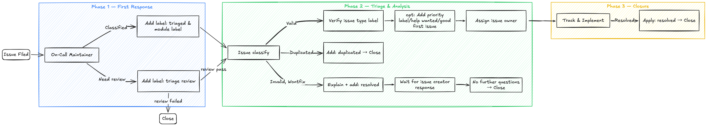

# Issue Workflow Guidelines

This document defines the standard lifecycle for Issues in the vLLM Ascend project — from creation through triage, active handling, and final closure. It establishes consistent label usage, owner assignment, and communication expectations to ensure smooth collaboration between contributors and maintainers.

## 1. Label Categories

### 1.1 Status Labels

These labels track where an issue stands in the workflow.

| Label           | Description                                                                                                                      |
|-----------------|----------------------------------------------------------------------------------------------------------------------------------|
| `triage review` | Newly filed or unseen issue awaiting initial assessment by a maintainer                                                          |
| `triaged`       | Assessment complete; type, priority, and module have been determined                                                             |
| `wait-feedback` | Blocked on an external dependency or awaiting a response before work can proceed                                                 |
| `resolved`      | Issue has been closed — either via a merged PR, or through non-code resolution (e.g., answered question, configuration guidance) |
| `stale`         | No activity for an extended period; parties have been notified and the issue will be auto-closed if there is no response         |
| `duplicated`    | A duplicate of an existing open issue or merged PR                                                                               |
| `invalid`       | The issue report is invalid, unclear, or not reproducible                                                                        |
| `wontfix`       | The issue will not be addressed; as this issue is out of scope, unviable, or intentionally ignored for the foreseeable future    |

### 1.2 Type Labels

These labels describe the nature of the issue.

| Label             | Description                                                                                      |
|-------------------|--------------------------------------------------------------------------------------------------|
| `feature request` | Request for new functionality                                                                    |
| `RFC`             | Request for Comments — significant architectural or design change requiring community discussion |
| `new model`       | Request to add support for a new model on Ascend NPU                                             |
| `usage`           | A usage question; no code change may be required                                                 |
| `question`        | A general question; no code change may be required                                               |
| `documentation`   | Improvements or corrections to documentation                                                     |
| `installation`    | Issues related to setup and deployment                                                           |
| `performance`     | Performance regression, bottleneck, or optimization request                                      |
| `bug`             | Something is not working correctly or behaves unexpectedly                                       |

### 1.3 Priority Labels (Optional)

| Label    | Description                                                    |
|----------|----------------------------------------------------------------|
| `high`   | High priority; should be resolved in the current or next cycle |
| `medium` | Normal priority; handled in the regular development flow       |
| `low`    | Low priority; edge case or minor issue that can be deferred    |

### 1.4 Contribution Labels (Optional)

| Label              | Description                                                      |
|--------------------|------------------------------------------------------------------|
| `good first issue` | A well-scoped, low-complexity task suitable for new contributors |
| `help wanted`      | Community contributions are welcome and encouraged               |

## 2. Workflow

### Phase 1 — First Response

When an issue is first picked up by the on-call maintainer:

- Apply `triaged` to signal that the issue can be classified and Add the relevant module label so the issue can be routed to the appropriate module maintainer for detailed triage.
- Apply `triage review` to signal that the issue requires more review and specitfic analysis before classification.

### Phase 2 — Triage and Analysis

After a thorough review of the issue content:

- Verify and apply the appropriate **issue type** label (`bug`, `feature request`, `RFC`, `question`, `documentation`, `installation`, `performance`, `new model`, etc.).
- Handle terminal states:
    - For duplicates, apply the `duplicated` label, provide an explanation and a link to the existing issue or PR. If there are no further questions, close the issue.
    - For invalid reports, provide an explanation, apply the `invalid` and `resolved` label, and close the issue. The issue creator can comment or request to reopen if they have further questions.
- Optionally apply a **priority** label (`high`, `medium`, or `low`).
- If community contributions are welcome, apply `help wanted`. For well-scoped beginner-friendly tasks, also apply `good first issue`.
- Assign the issue owner and replace `triage review` with `triaged` to indicate that triage is complete.

### Phase 3 — Closure

After triage, the issue moves into tracking and implementation:

- Keep the issue in progress until it is resolved through a merged PR or another confirmed resolution path.
- Once the issue is resolved, apply `resolved` and close it, ideally with a reference to the merged PR or a short explanation of the resolution.
- If the issue remains inactive for an extended period, apply `stale` as the final state before auto-closure.
