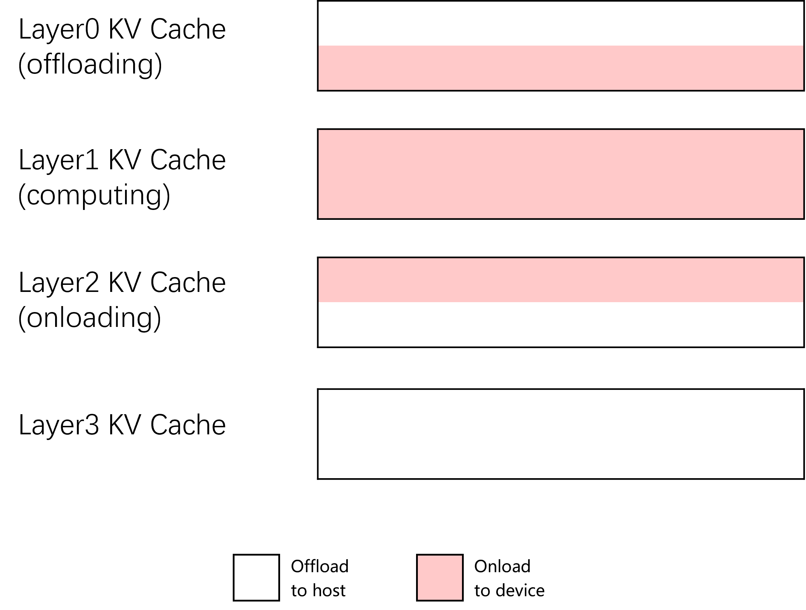
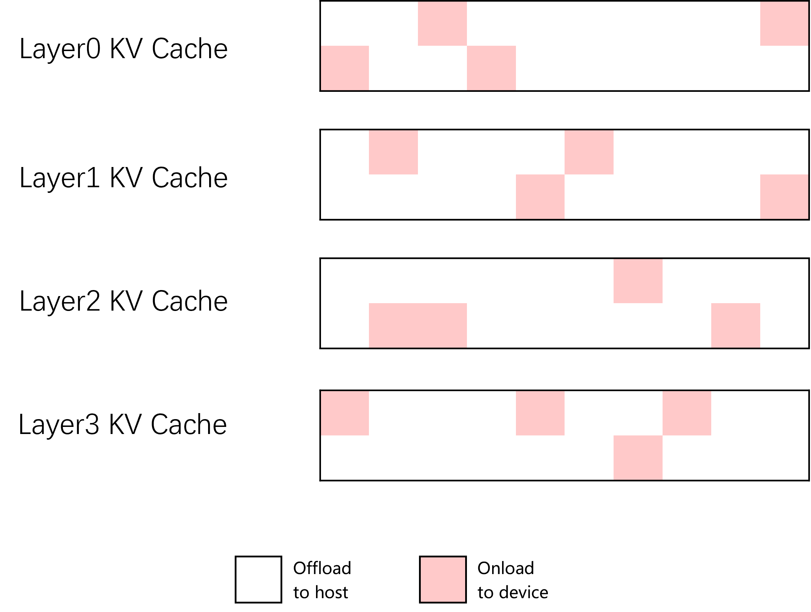
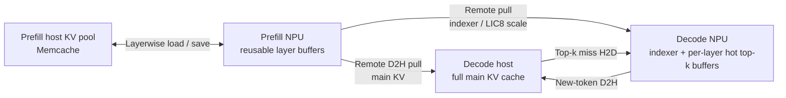

# Layerwise and Sparse KV Cache Offloading Design

This document explains why Prefill and Decode use different KV cache offload
strategies, how the two strategies work, and how they preserve correctness when
used together.

For installation and configuration, see
[Layerwise and Sparse KV Cache Offloading Guide](../../user_guide/feature_guide/layerwise_and_sparse_kv_cache_offloading.md).

The design is based on
[RFC #48203](https://github.com/vllm-project/vllm/issues/48203).

## 1. Motivation

KV cache is a major NPU memory cost in long-sequence inference. Moving it to
host memory increases capacity, but Prefill and Decode cannot use the same
transfer strategy efficiently.

| Stage | Compute pattern | Offload strategy | NPU-resident data |
| :--- | :--- | :--- | :--- |
| Prefill | High computation per layer | Transfer complete layers and overlap transfer with computation | A few reusable layer buffers |
| Decode | Low computation per token | Keep full KV in host memory and load only selected entries | Indexer cache and per-layer hot top-k buffers |

Loading a complete layer during every Decode step would add transfer latency
that cannot be hidden by Decode computation. Sparse Decode Offload avoids that
cost by moving only the entries selected by sparse attention.

The following conceptual diagrams illustrate the difference. In Prefill, a
small number of complete-layer buffers are reused over time. In Decode, the
full main-KV history stays in host memory, while the full indexer cache and
sparse main-KV selections remain on the NPU. Device memory in the RFC figures
corresponds to NPU HBM in this implementation.



*Layerwise Prefill Offload. Source: [RFC #48203](https://github.com/vllm-project/vllm/issues/48203).*



*Sparse Decode Offload. Source: [RFC #48203](https://github.com/vllm-project/vllm/issues/48203).*

## 2. System Overview

The production design targets disaggregated Prefill/Decode deployment. Hybrid
KV cache layouts are not currently supported. P/D colocation is limited to a
debug path and is not part of the supported production workflow.

The combined design has four storage regions:

- reusable layer buffers in Prefill NPU memory;
- the Memcache-backed Prefill host KV pool;
- the full main KV cache in Decode host memory; and
- the indexer cache and per-layer hot top-k buffers in Decode NPU memory.



`AscendStoreConnector` manages Layerwise Prefill Offload through Memcache.
`SfaRemoteD2HConnector` exposes Prefill NPU buffers and lets Decode pull main KV
into Decode-owned host memory and indexer data into rank-local NPU memory
through MemFabric. Optional LIC8 scale data follows the indexer destination.

### Transfer granularity

The data path uses different transfer granularities according to when the
required addresses become known:

| Path | Granularity | Purpose |
| :--- | :--- | :--- |
| Prefill NPU to Decode host | Layer/block ranges | Populate Decode's full main KV history |
| Prefill NPU to Decode NPU | Block ranges within indexer/scale tensors | Populate rank-local indexer and optional LIC8 scale data |
| Decode current KV to Decode host | Token rows | Append newly generated KV without a full NPU main cache |
| Decode host to Decode NPU | Top-k miss rows | Populate only missing entries in the per-layer hot buffer |

The Prefill transfers are known after each layer finishes and can be issued in
larger ranges. Decode miss addresses are known only after top-k selection and
residency lookup, so they use sparse token-row copies.

## 3. Layerwise Prefill Offload

### Buffer planning

Layerwise Prefill Offload maps many logical cache-bearing layers onto fewer
physical NPU buffers. Some layers can keep dedicated buffers; the remaining
compatible layers share a reusable buffer pool.

For a uniform cache layout:

```text
N = number of cache-bearing layers
I = number of independent layers
R = N - I
B = configured shared-buffer count

physical buffers = I + min(B, R)

main-KV NPU footprint ratio ~= physical buffers / N
```

The footprint ratio assumes a uniform cache layout with equal-size layer
buffers. It describes only main-KV storage and does not include the indexer or
other fixed NPU allocations.

Reusable layers are assigned to the shared buffers in round-robin order.
Layers with incompatible main KV specifications do not share a physical
buffer. MTP layers participate in the same planning. Optional indexer caches
follow their main buffer assignment and are allocated only where needed.

Before tensor descriptors are merged, the planner validates cache
specifications, tensor sizes, and optional indexer layouts. An incompatible
layout fails initialization instead of sharing incorrectly sized storage.

### Execution pipeline

For each layer:

1. load the cached prefix from Memcache when required;
2. wait until the target physical buffer is safe to overwrite;
3. run attention and update KV;
4. save the updated KV to host memory; and
5. prefetch a later layer while computation continues.

Multiple physical buffers let transfer and computation overlap. Prefill has
enough per-layer computation to hide much of the load and save latency, which
is why full-layer transfer is suitable for this stage.

### Reuse invariant

A physical buffer cannot be reused until every consumer of its previous
contents has finished. Its Memcache save must complete before reuse. In the
joint deployment, the Decode-side remote read must also complete.

The implementation tracks completion by physical storage slot rather than only
by logical layer name. This matters because several logical layers can refer to
the same NPU address.

## 4. Sparse Decode Offload

### Memory layout

Sparse Decode Offload keeps the full main KV cache in a pinned Decode host
pool. Decode NPU memory contains:

- the rank-local indexer cache used to select important tokens; and
- per-layer K/V hot buffers containing recently selected main-KV entries for
  active Decode rows.

Each Decode DP rank owns a separate main host pool. Within one DP rank, its TP
ranks share that pool, while every TP rank owns the indexer data required by its
local attention computation. Control-plane ports are assigned as
`kv_port + dp_rank * d_tp_size + tp_rank`, keeping DP and TP endpoints disjoint.

### Decode step

For each Decode step:

1. Decode generates the new-token K/V without writing it to a full NPU paged
   main cache;
2. the new K/V rows are copied to their logical slots in the shared host pool;
3. the indexer selects logical top-k token positions;
4. the per-layer LRU residency table identifies hits, assigns physical hot
   buffer slots to misses, and selects eviction slots when necessary;
5. only miss rows are copied from host memory to the NPU;
6. logical top-k positions are remapped to physical hot-buffer slots; and
7. sparse attention consumes the resident K/V while residency metadata is
   retained for the next step.

With tensor parallelism, Decode-produced K/V is replicated. TP rank 0 allocates
the shared host pool and writes the new-token rows. All TP ranks access that
allocation through the broadcast global virtual addresses provided by the
MemFabric offload path.

The full history remains available in host memory, but transfer volume is
proportional to top-k misses rather than total sequence length. This makes
offload practical for the low-compute Decode stage.

## 5. Joint Prefill and Decode Design

### Connector composition

Prefill uses `MultiConnector` to compose the Remote D2H completion provider and
`AscendStoreConnector`. `AscendMultiConnector` invokes the completion provider
first regardless of their order in the connector configuration. For every
layer buffer:

- AscendStore saves the layer to the Prefill host KV pool; and
- Remote D2H publishes source metadata and waits for Decode acknowledgements.

The buffer-reuse gate opens only after both paths finish. This prevents Prefill
from overwriting a shared physical buffer while Decode is still reading it.

### Request flow

1. Decode allocates its main host destination and rank-local indexer
   destination.
2. Decode advertises its endpoint and parallel topology through the proxy
   metaserver.
3. Prefill computes the request layer by layer.
4. After each layer's KV write completes, Prefill starts the Memcache save and
   publishes Remote D2H readiness.
5. Decode pulls the layer into its destinations and acknowledges completion.
6. Prefill releases the physical buffer for reuse after all required
   completions arrive.
7. Decode schedules the request only after the full request reaches a terminal
   transfer state across all required ranks.

Physical-buffer completion and request completion are separate:

- physical-buffer completion protects Prefill memory reuse; and
- request completion controls when Decode may begin inference.

## 6. Unequal Tensor Parallelism

The supported joint topology is:

```text
p_tp_size >= d_tp_size
p_tp_size % d_tp_size == 0
ratio = p_tp_size // d_tp_size
```

For Prefill rank `p_rank`:

```text
d_rank = p_rank // ratio
group_member_idx = p_rank % ratio
```

The Prefill ranks mapped to one Decode rank form a contributor group.

- Main KV is replicated on Prefill, so only contributor member `0` transfers
  the main share owned by that Decode rank.
- Contributors transfer disjoint indexer ranges whose union forms the complete
  rank-local Decode indexer.
- A contributor with no blocks still acknowledges the layer so completion
  cannot deadlock.

## 7. Validation and Failure Handling

Before a Remote D2H read, Decode validates main tensor count and sizes, indexer
presence and sizes, optional LIC8 scale layout, and destination block ranges.
A mismatch fails the layer instead of leaving partially valid destination
data.

After Decode processes a readiness notification, it replies with `READ_DONE` or
`READ_FAILED`. A reported MemFabric read failure invalidates the Decode
destination and releases the Prefill-side waiter with an error, preventing
silent corruption. A lost acknowledgement or stopped Decode process is not
treated as a terminal state, so Prefill may continue waiting.

## 8. Current Boundaries

- Layerwise shared-buffer offload requires the Memcache backend and eager mode.
- Sparse Decode Offload requires Model Runner V1 and an SFA/MLA sparse-attention
  model. The main KV cache must use BF16; LIC8 quantization is supported only
  for the device-resident indexer cache.
- Hybrid KV cache layouts are not supported.
- Sparse Decode Offload supports DP and TP; CP and PP are not supported.
- Joint deployment requires Prefill TP to be greater than or equal to, and
  divisible by, Decode TP.
- MemFabric is the only supported Remote D2H transfer backend.
- Layerwise buffer reuse cannot currently be combined with
  `MooncakeLayerwiseConnector` because it does not provide a per-buffer transfer
  completion gate. Support is planned in a follow-up update.
- Connector-level data-read retry is not implemented.
