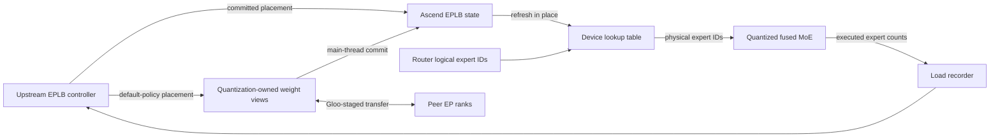

# Model Runner V2 EPLB Architecture

Model Runner V2 on Ascend uses the upstream vLLM Expert Parallelism Load
Balancer (EPLB) control plane and adds a small Ascend-specific integration
plane. Upstream code owns load windows, policy execution, placement state, and
the rearrangement transaction. vLLM Ascend owns device routing, executed-load
recording, quantized expert-weight views, and the asynchronous Gloo-staged
movement adapter.

This page describes the current asynchronous architecture. For the decisions
behind this ownership model, see
[RFC #13410](https://github.com/vllm-project/vllm-ascend/issues/13410). For
user-visible configuration and the supported feature matrix, see the
[EPLB user guide](../../user_guide/feature_guide/expert_parallelism_load_balancer.md).

## Mental model

EPLB has a control plane and a data plane:

- The **control plane** decides where each logical expert is placed and when
  the placement changes. Its source of truth is the upstream `EplbState`.
- The **data plane** maps each token's logical expert choice to the physical
  expert installed on the local rank, runs fused MoE, and records the experts
  that actually executed.
- The **movement plane** exposes the real quantized expert storage and moves it
  through the upstream rearrangement transaction using a Gloo-staged worker;
  the model-runner thread commits completed layers between forwards.

The Ascend integration adapts the boundaries between these planes; it does not
implement a second controller or placement lifecycle.

## Component boundaries

| Component | Responsibility |
| --- | --- |
| Upstream `EPLBController`, `EplbState`, and async worker | Load windows, default policy invocation, placement calculation, and rearrangement ordering |
| `AscendEPLBController` | Batch load-collection-phase filtering and construction of Ascend state |
| `AscendEplbState` and `AscendEplbLayerState` | Stable device lookup derived from committed upstream placement |
| Router adapter | Per-instance logical-to-physical ID mapping without replacing the upstream router class |
| Fused MoE EPLB helpers | Device lookup and post-compute physical load recording |
| Quantization method | View of the expert tensors and metadata actually consumed by its kernel |
| `AscendGlooEplbCommunicator` | Upstream asynchronous communicator contract implemented with CPU staging over Gloo |
| Platform patch | Capability adaptation and the narrow construction/commit hooks not exposed by upstream |

The platform patch is an entry adapter. Runtime routing, state management, and
communication live in explicit components so that patching does not become an
alternative implementation of EPLB.

## Request and layer flow

At runner initialization, platform validation checks the Model Runner version,
EPLB mode, quantization layout, and execution features. Unsupported
combinations fail before serving. Model Runner V1 keeps its legacy EPLB path;
Model Runner V2 uses the upstream control plane. V1-only controls and V2 EPLB
configuration cannot be mixed.

At the start of a Model Runner V2 batch, the runner tells
`AscendEPLBController` whether the batch belongs to the configured load
collection phase. The phase may collect all batches, prefill batches, or decode
batches. A mixed batch containing prefill work is classified as prefill. This
decision is made once per batch rather than once per token or MoE layer.

Each MoE layer then follows one routing path:

1. The upstream router selects logical experts and produces routing weights.
2. The instance-bound Ascend router adapter gathers physical expert IDs from
   the layer's device lookup.
3. The quantization method receives the routing weights and physical IDs and
   runs fused MoE. It does not select experts again.
4. The same device operation records selected physical experts in the upstream
   load buffer when its collection phase is enabled, then fused MoE executes.

Phase selection filters only the load submitted by a rank. Every rank still
advances the upstream EPLB state machine and participates in its collectives in
the same order, even when local batches belong to different phases.

The lookup is a fixed-shape device tensor whose object identity remains stable.
When placement changes, `AscendEplbLayerState` builds the new values and copies
them into the existing tensor. Long-lived router instances and compiled call
sites therefore keep a valid reference without reconstructing Python objects
in the layer hot path.

## Rearrangement and weight views

When an upstream load window closes, vLLM's default policy calculates a new
placement and the upstream asynchronous worker stages expert tensors through
Gloo one layer at a time. The model-runner thread installs each published
layer, commits its placement, and refreshes the device lookup before
acknowledging the staging buffer. Routing never observes a lookup for an
uncommitted placement.

Expert storage is quantization-specific. Some kernels consume independent
per-expert tensors, while others consume packed tensors or associated scale and
metadata layouts. Each supported quantization method exposes a weight view of
the exact storage read by compute. Rearrangement operates through that view;
it does not assume that a canonical model parameter is the active kernel
storage.

Support therefore requires all of the following for a format:

- the compute tensors and coupled metadata can be identified;
- the view preserves the ordering expected by the upstream movement contract;
- movement updates the same storage used by the fused kernel;
- post-move execution remains valid for repeated rearrangements.

Formats that cannot satisfy these conditions are rejected during validation.
The current format and execution-mode support table lives in the
[EPLB user guide](../../user_guide/feature_guide/expert_parallelism_load_balancer.md),
not in this architecture page.

## Communication and synchronization

`AscendGlooEplbCommunicator` implements the upstream asynchronous communicator
interface. Expert tensors are staged through CPU memory because the background
worker does not issue HCCL collectives. Foreground MoE communication remains on
its normal device path.

Only asynchronous EPLB is supported. The upstream worker publishes one layer
at a time and waits for the model-runner thread to acknowledge consumption
before reusing the staging workspace. The Ascend commit adapter delays that
acknowledgement until the layer's device lookup has been refreshed.

## Invariants

Changes to this integration must preserve these invariants:

1. Upstream placement state is the only source of truth for Model Runner V2.
2. Expert selection runs once; quantized compute consumes physical expert IDs.
3. The device lookup changes only after the corresponding placement commits.
4. Load is recorded in the physical expert ID space by the graph-safe routing
   operation and excludes padding.
5. Weight movement updates the exact storage used by the active quantized
   kernel.
6. The worker does not reuse staging storage before the main thread commits
   the layer and refreshes routing.
7. Unsupported modes fail during initialization instead of silently degrading.
8. EPLB-disabled execution and the Model Runner V1 EPLB path remain isolated.
9. The routing hot path avoids host loops, device-to-host synchronization, and
   mutable Python mapping work.

## Extension and debugging anchors

When adding a quantization format, begin with its expert-weight view and prove
that the fused kernel reads the moved tensors. Do not add layout knowledge to
the controller or router. When adding an execution mode, check its placement
commit boundary and whether router instances retain the stable lookup.

For stale or incorrect expert selection after rearrangement, inspect the
committed `EplbState` and the in-place lookup refresh. For successful movement
with unchanged model behavior, inspect the quantization-owned weight view. For
missing or shifted load statistics, verify that the fused routing operation
records physical IDs and excludes padding. Startup rejections should be checked against
the user-guide support matrix and
[additional configuration reference](../../user_guide/configuration/additional_config.md).

Repository test placement and registration rules are documented in the
[testing guide](../contribution/testing.md).
