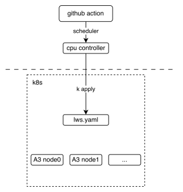
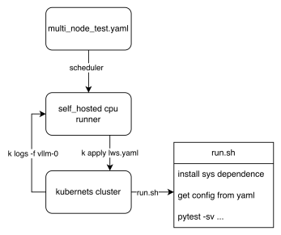

# Multi Node Test

Multi-Node CI is designed to test distributed scenarios of very large models, eg: disaggregated_prefill multi DP across multi nodes and so on.

## How is works

The following picture shows the basic deployment view of the multi-node CI mechanism, It shows how the github action interact with [lws](https://lws.sigs.k8s.io/docs/overview/) (a kind of kubernetes crd resource)



From the workflow perspective, we can see how the final test script is executed, The key point is that these two [lws.yaml and run.sh](https://github.com/vllm-project/vllm-ascend/tree/main/tests/e2e/nightly/multi_node/scripts), The former defines how our k8s cluster is pulled up, and the latter defines the entry script when the pod is started, Each node executes different logic according to the [LWS_WORKER_INDEX](https://lws.sigs.k8s.io/docs/reference/labels-annotations-and-environment-variables/) environment variable, so that multiple nodes can form a distributed cluster to perform tasks.



## How to contribute

1. Upload custom weights

   If you need customized weights, for example, you quantized a w8a8 weight for DeepSeek-V3 and you want your weight to run on CI, Uploading weights to ModelScope's [vllm-ascend](https://www.modelscope.cn/organization/vllm-ascend) organization is welcome, If you do not have permission to upload, please contact @Potabk

2. Add config yaml

    As the entrypoint script [run.sh](https://github.com/vllm-project/vllm-ascend/blob/0bf3f21a987aede366ec4629ad0ffec8e32fe90d/tests/e2e/nightly/multi_node/scripts/run.sh#L106) shows, A k8s pod startup means traversing all *.yaml files in the [directory](https://github.com/vllm-project/vllm-ascend/tree/main/tests/e2e/nightly/multi_node/config/models), reading and executing according to different configurations, so what we need to do is just add "yamls" like [DeepSeek-V3.yaml](https://github.com/vllm-project/vllm-ascend/blob/main/tests/e2e/nightly/multi_node/config/models/DeepSeek-V3.yaml).

    Suppose you have **2 nodes** running a 1P1D setup (1 Prefillers + 1 Decoder):

    you may add a config file looks like:

    ```yaml
    test_name: "test DeepSeek-V3 disaggregated_prefill"
    # the model being tested
    model: "vllm-ascend/DeepSeek-V3-W8A8"
    # how large the cluster is
    num_nodes: 2
    npu_per_node: 16
    # All env vars you need should add it here
    env_common:
    VLLM_USE_MODELSCOPE: true
    OMP_PROC_BIND: false
    OMP_NUM_THREADS: 100
    HCCL_BUFFSIZE: 1024
    SERVER_PORT: 8080
    disaggregated_prefill:
    enabled: true
    # node index(a list) which meet all the conditions:
    #  - prefiller
    #  - no headless(have api server)
    prefiller_host_index: [0]
    # node index(a list) which meet all the conditions:
    #  - decoder
    #  - no headless(have api server)
    decoder_host_index: [1]

    # Add each node's vllm serve cli command just like you run locally
    deployment:
    -
        server_cmd: >
            vllm serve ...
    -
        server_cmd: >
            vllm serve ...
    benchmarks:
    perf:
        # fill with performance test kwargs
    acc:
        # fill with accuracy test kwargs
    ```
  
3. Add the case to nightly workflow
currently, the multi-node test workflow defined in the [vllm_ascend_test_nightly_a2/a3.yaml](https://github.com/vllm-project/vllm-ascend/blob/main/.github/workflows/vllm_ascend_test_nightly_a3.yaml)

   ```yaml
    multi-node-tests:
        needs: single-node-tests
        if: always() && (github.event_name == 'schedule' || github.event_name == 'workflow_dispatch')
        strategy:
        fail-fast: false
        max-parallel: 1
        matrix:
            test_config:
            - name: multi-node-deepseek-pd
                config_file_path: tests/e2e/nightly/multi_node/config/models/DeepSeek-V3.yaml
                size: 2
            - name: multi-node-qwen3-dp
                config_file_path: tests/e2e/nightly/multi_node/config/models/Qwen3-235B-A3B.yaml
                size: 2
            - name: multi-node-dpsk-4node-pd
                config_file_path: tests/e2e/nightly/multi_node/config/models/DeepSeek-R1-W8A8.yaml
                size: 4
        uses: ./.github/workflows/_e2e_nightly_multi_node.yaml
        with:
        soc_version: a3
        image: m.daocloud.io/quay.io/ascend/cann:8.3.rc2-a3-ubuntu22.04-py3.11
        replicas: 1
        size: ${{ matrix.test_config.size }}
        config_file_path: ${{ matrix.test_config.config_file_path }}
   ```
  
The matrix above defines all the parameters required to add a multi-machine use case, The parameters worth paying attention to (I mean if you are adding a new use case) are size and the path to the yaml configuration file. The former defines the number of nodes required for your use case, and the latter defines the path to the configuration file you have completed in step 2.
