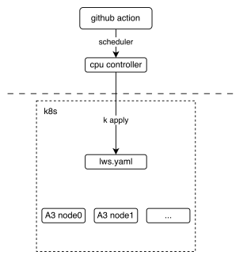
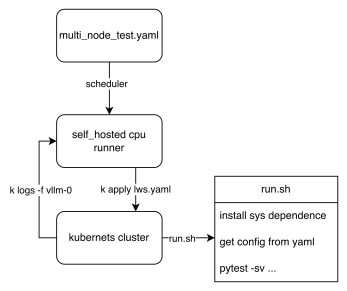

# Multi Node Test

Multi-Node CI is designed to test distributed scenarios of very large models, eg: disaggregated_prefill multi DP across multi nodes and so on.

## How it works

The following picture shows the basic deployment view of the multi-node CI mechanism. It shows how the GitHub action interacts with [lws](https://lws.sigs.k8s.io/docs/overview/) (a kind of kubernetes crd resource).



From the workflow perspective, we can see how the final test script is executed, The key point is that the shared files `tests/e2e/nightly/multi_node/scripts/lws.yaml.jinja2` and `tests/e2e/nightly/multi_node/scripts/run.sh` define the cluster template and pod entry script. Each node executes different logic according to the [LWS_WORKER_INDEX](https://lws.sigs.k8s.io/docs/reference/labels-annotations-and-environment-variables/) environment variable, so that multiple nodes can form a distributed cluster to perform tasks. `run.sh` selects the pytest entrypoint from the config path: internal DP configs use `internal_dp/scripts/test_multi_node.py`, while external DP configs use `external_dp/scripts/test_external_dp.py`.



## How to contribute

1. Upload custom weights

   If you need customized weights, for example, you quantized a w8a8 weight for DeepSeek-V3 and you want your weight to run on CI, uploading weights to ModelScope's [vllm-ascend](https://www.modelscope.cn/organization/vllm-ascend) organization is welcome. If you do not have permission to upload, please contact @Potabk

2. Add config yaml

    For the normal internal DP multi-node flow, add the config yaml to `tests/e2e/nightly/multi_node/internal_dp/config/`, like `DeepSeek-V3.yaml`. External DP cases use the separate `tests/e2e/nightly/multi_node/external_dp/config/` directory and should pass that directory through `config_base_path` in workflow or `CONFIG_BASE_PATH` locally.

    Suppose you have **2 nodes** running a 1P1D setup (1 Prefillers + 1 Decoder):

    you may add a config file looks like:

    ```yaml
    test_name: "test DeepSeek-V3 disaggregated_prefill"
    # the model being tested
    model: "vllm-ascend/DeepSeek-V3-W8A8"
    # how large the cluster is
    num_nodes: 2
    npu_per_node: 16
    # All env vars you need should add it here
    env_common: &env_common
      VLLM_USE_MODELSCOPE: true
      OMP_PROC_BIND: false
      OMP_NUM_THREADS: 100
      HCCL_BUFFSIZE: 1024
      SERVER_PORT: 8080
    disaggregated_prefill:
      enabled: true
      # node index(a list) which meet all the conditions:
      #  - prefiller
      #  - no headless(have api server)
      prefiller_host_index: [0]
      # node index(a list) which meet all the conditions:
      #  - decoder
      decoder_host_index: [1]

    # Add each node's vllm serve cli command just like you run locally
    # Add each node's individual envs like follow
    deployment:
    - name: prefiller node # optional: just for description, not used in code
      envs:
        <<: *env_common
        VLLM_ASCEND_ENABLE_FLASHCOMM1: 1
        # Continue to add other envs if needed
      server_cmd: >
        vllm serve ...
    - name: decoder node # optional: just for description, not used in code
      envs:
        <<: *env_common
        VLLM_ASCEND_ENABLE_FLASHCOMM1: 1
        # Continue to add other envs if needed
      server_cmd: >
        vllm serve ...
    benchmarks:
      perf:
        # fill with performance test kwargs
      acc:
        # fill with accuracy test kwargs
    ```

3. Add the case to nightly workflow

Currently, the multi-node test workflow is defined in `.github/workflows/schedule_nightly_test_a3.yaml`.

    ```yaml
    multi-node-tests:
      name: multi-node
      if: always() && (github.event_name == 'schedule' || github.event_name == 'workflow_dispatch')
      strategy:
        fail-fast: false
        max-parallel: 1
        matrix:
          test_config:
            - name: multi-node-deepseek-pd
              config_file_path: DeepSeek-V3.yaml
              size: 2
            - name: multi-node-qwen3-dp
              config_file_path: Qwen3-235B-A22B.yaml
              size: 2
            - name: GLM5_1-W8A8-EP-external
              config_file_path: GLM5_1-W8A8-EP-external.yaml
              config_base_path: tests/e2e/nightly/multi_node/external_dp/config/
              size: 4
      uses: ./.github/workflows/_e2e_nightly_multi_node.yaml
      with:
        soc_version: a3
        runner: linux-aarch64-a3-0
        image: 'swr.cn-southwest-2.myhuaweicloud.com/base_image/ascend-ci/vllm-ascend:nightly-a3'
        replicas: 1
        size: ${{ matrix.test_config.size }}
        config_file_path: ${{ matrix.test_config.config_file_path }}
        config_base_path: ${{ matrix.test_config.config_base_path || '' }}
        name: ${{ matrix.test_config.name }}
      secrets:
        KUBECONFIG_B64: ${{ secrets.KUBECONFIG_B64 }}
    ```
  
The matrix above defines all the parameters required to add a multi-machine use
case. The parameters worth noting are `size`, `config_file_path`, and
`config_base_path`. `size` defines the number of nodes required for your use
case. `config_file_path` is the yaml file name, and `config_base_path` tells the
loader which config directory to use. For internal DP cases, use an empty
`config_base_path` so the loader uses its default internal DP config directory.
For external DP cases, set it to
`tests/e2e/nightly/multi_node/external_dp/config/`.

## Run Multi-Node tests locally

### 1. Use kubernetes

This section assumes that you already have a [Kubernetes](https://kubernetes.io/docs/setup/) NPU cluster environment locally. Then you can easily start our test with one click.

- Step 1. Install LWS CRD resources

    See <https://lws.sigs.k8s.io/docs/installation/> Which can be used as a reference

- Step 2. Deploy the following yaml file `lws.yaml` as needed

    ```yaml
    apiVersion: leaderworkerset.x-k8s.io/v1
    kind: LeaderWorkerSet
    metadata:
      name: test-server
      namespace: vllm-project
    spec:
      replicas: 1
      leaderWorkerTemplate:
        size: 2
        restartPolicy: None
        leaderTemplate:
          metadata:
            labels:
              role: leader
          spec:
            containers:
              - name: vllm-leader
                imagePullPolicy: Always
                image: swr.cn-southwest-2.myhuaweicloud.com/base_image/ascend-ci/vllm-ascend:nightly-a3
                env:
                  - name: CONFIG_YAML_PATH
                    value: DeepSeek-V3.yaml
                  - name: CONFIG_BASE_PATH
                    value: tests/e2e/nightly/multi_node/internal_dp/config/
                  - name: WORKSPACE
                    value: "/vllm-workspace"
                  - name: FAIL_TAG
                    value: FAIL_TAG
                command:
                  - sh
                  - -c
                  - |
                    bash /vllm-workspace/vllm-ascend/tests/e2e/nightly/multi_node/scripts/run.sh
                resources:
                  limits:
                    huawei.com/ascend-1980: 16
                    memory: 512Gi
                    ephemeral-storage: 100Gi
                  requests:
                    huawei.com/ascend-1980: 16
                    memory: 512Gi
                    ephemeral-storage: 100Gi
                    cpu: 125
                ports:
                  - containerPort: 8080
                # readinessProbe:
                #   tcpSocket:
                #     port: 8080
                #   initialDelaySeconds: 15
                #   periodSeconds: 10
                volumeMounts:
                  - mountPath: /root/.cache
                    name: shared-volume
                  - mountPath: /usr/local/Ascend/driver/tools
                    name: driver-tools
                  - mountPath: /dev/shm
                    name: dshm
            volumes:
              - name: dshm
                emptyDir:
                  medium: Memory
                  sizeLimit: 15Gi
              - name: shared-volume
                persistentVolumeClaim:
                  claimName: nv-action-vllm-benchmarks-v2
              - name: driver-tools
                hostPath:
                  path: /usr/local/Ascend/driver/tools
        workerTemplate:
          spec:
            containers:
              - name: vllm-worker
                imagePullPolicy: Always
                image: swr.cn-southwest-2.myhuaweicloud.com/base_image/ascend-ci/vllm-ascend:nightly-a3
                env:
                  - name: CONFIG_YAML_PATH
                    value: DeepSeek-V3.yaml
                  - name: CONFIG_BASE_PATH
                    value: tests/e2e/nightly/multi_node/internal_dp/config/
                  - name: WORKSPACE
                    value: "/vllm-workspace"
                  - name: FAIL_TAG
                    value: FAIL_TAG
                command:
                  - sh
                  - -c
                  - |
                    bash /vllm-workspace/vllm-ascend/tests/e2e/nightly/multi_node/scripts/run.sh
                resources:
                  limits:
                    huawei.com/ascend-1980: 16
                    memory: 512Gi
                    ephemeral-storage: 100Gi
                  requests:
                    huawei.com/ascend-1980: 16
                    ephemeral-storage: 100Gi
                    cpu: 125
                volumeMounts:
                  - mountPath: /root/.cache
                    name: shared-volume
                  - mountPath: /usr/local/Ascend/driver/tools
                    name: driver-tools
                  - mountPath: /dev/shm
                    name: dshm
            volumes:
              - name: dshm
                emptyDir:
                  medium: Memory
                  sizeLimit: 15Gi
              - name: shared-volume
                persistentVolumeClaim:
                  claimName: nv-action-vllm-benchmarks-v2
              - name: driver-tools
                hostPath:
                  path: /usr/local/Ascend/driver/tools
    ---
    apiVersion: v1
    kind: Service
    metadata:
      name: vllm-leader
      namespace: vllm-project
    spec:
      ports:
        - name: http
          port: 8080
          protocol: TCP
          targetPort: 8080
      selector:
        leaderworkerset.sigs.k8s.io/name: vllm
        role: leader
      type: ClusterIP
    ```

    ```bash
    kubectl apply -f lws.yaml
    ```

    Verify the status of the pods:

    ```bash
    kubectl get pods -n vllm-project
    ```

    Should get an output similar to this:

    ```bash
    NAME       READY   STATUS    RESTARTS   AGE
    vllm-0     1/1     Running   0          2s
    vllm-0-1   1/1     Running   0          2s
    ```

    Verify that the distributed inference works:

    ```bash
    kubectl logs -f vllm-0 -n vllm-project
    ```

    Should get something similar to this:

    ```shell
    INFO 12-30 11:00:57 [__init__.py:43] Available plugins for group vllm.platform_plugins:
    INFO 12-30 11:00:57 [__init__.py:45] - ascend -> vllm_ascend:register
    INFO 12-30 11:00:57 [__init__.py:48] All plugins in this group will be loaded. Set `VLLM_PLUGINS` to control which plugins to load.
    INFO 12-30 11:00:57 [__init__.py:217] Platform plugin ascend is activated
    INFO 12-30 11:00:57 [importing.py:68] Triton not installed or not compatible; certain GPU-related functions will not be available.
    ================================================================================================== test session starts ===================================================================================================
    platform linux -- Python 3.12.13, pytest-8.4.2, pluggy-1.6.0 -- /usr/local/python3.12.13/bin/python3
    cachedir: .pytest_cache
    rootdir: /vllm-workspace/vllm-ascend
    configfile: pyproject.toml
    plugins: cov-7.0.0, asyncio-1.3.0, mock-3.15.1, anyio-4.12.0
    asyncio: mode=Mode.STRICT, debug=False, asyncio_default_fixture_loop_scope=None, asyncio_default_test_loop_scope=function
    collected 1 item

    tests/e2e/nightly/multi_node/internal_dp/scripts/test_multi_node.py::test_multi_node [2025-12-30 11:01:01] INFO multi_node_config.py:294: Loading config yaml: tests/e2e/nightly/multi_node/internal_dp/config/DeepSeek-V3.yaml
    [2025-12-30 11:01:01] INFO multi_node_config.py:348: Resolving cluster IPs via DNS...
    [2025-12-30 11:01:01] INFO multi_node_config.py:212: Node 0 envs: {'VLLM_USE_MODELSCOPE': 'True', 'OMP_PROC_BIND': 'False', 'OMP_NUM_THREADS': '100', 'HCCL_BUFFSIZE': '1024', 'SERVER_PORT': '8080', 'NUMEXPR_MAX_THREADS': '128', 'DISAGGREGATED_PREFILL_PROXY_SCRIPT': 'examples/disaggregated_prefill_v1/load_balance_proxy_server_example.py', 'HCCL_IF_IP': '10.0.0.102', 'HCCL_SOCKET_IFNAME': 'eth0', 'GLOO_SOCKET_IFNAME': 'eth0', 'TP_SOCKET_IFNAME': 'eth0', 'LOCAL_IP': '10.0.0.102', 'NIC_NAME': 'eth0', 'MASTER_IP': '10.0.0.102'}
    [2025-12-30 11:01:01] INFO multi_node_config.py:159: Launching proxy: python examples/disaggregated_prefill_v1/load_balance_proxy_server_example.py --host 10.0.0.102 --port 6000 --prefiller-hosts 10.0.0.102 --prefiller-ports 8080 --decoder-hosts 10.0.0.138 --decoder-ports 8080
    [2025-12-30 11:01:01] INFO conftest.py:107: Starting server with command: vllm serve vllm-ascend/DeepSeek-V3-W8A8 --host 0.0.0.0 --port 8080 --data-parallel-size 2 --data-parallel-size-local 2 --tensor-parallel-size 8 --seed 1024 --enforce-eager --enable-expert-parallel --max-num-seqs 16 --max-model-len 8192 --max-num-batched-tokens 8192 --quantization ascend --trust-remote-code --no-enable-prefix-caching --gpu-memory-utilization 0.9 --kv-transfer-config {"kv_connector": "MooncakeConnectorV1", "kv_role": "kv_producer", "kv_port": "30000", "engine_id": "0", "kv_connector_extra_config": {
            "prefill": {
                    "dp_size": 2,
                    "tp_size": 8
            },
            "decode": {
                    "dp_size": 2,
                    "tp_size": 8
            }
        }
    }
    ```

### 2. Test without Kubernetes

The same `tests/e2e/nightly/multi_node/scripts/run.sh` entrypoint can be used
on prepared bare-metal or container hosts. Without LWS, set the values that
Kubernetes normally injects yourself:

- `cluster_hosts` in the config yaml, using IPs reachable from every node.
- `LWS_WORKER_INDEX` on each node, starting from `0`.
- `CONFIG_YAML_PATH` as the config file name and `CONFIG_BASE_PATH` as the
  config directory.

Use the host NIC IPs that can reach each other, for example addresses shown by
`ip addr` or `ifconfig` on the active network interface. Do not use per-host
Docker bridge addresses such as `172.17.0.1`, because each host has its own
local bridge.

Local `cluster_hosts` edits should be removed before submitting a PR unless the
hosts are part of a committed test environment.

#### 2.1 Internal DP local run

##### 2.1.1 Add cluster hosts

Edit the internal DP config you want to run, for example:

```text
tests/e2e/nightly/multi_node/internal_dp/config/DeepSeek-V3.yaml
```

Add `cluster_hosts` as a top-level field, for example near `num_nodes` and
`npu_per_node`:

```yaml
cluster_hosts:
  - "172.22.0.xxx"
  - "172.22.0.xxx"
```

##### 2.1.2 Prepare the environment

Install vllm-ascend development dependencies on every cluster host:

```bash
cd /vllm-workspace/vllm-ascend
python3 -m pip install -r requirements-dev.txt
```

Install AISBench on the first host, which is the node with
`LWS_WORKER_INDEX=0`:

```bash
export AIS_BENCH_TAG="v3.1-20260330-master"
export AIS_BENCH_URL="https://github.com/AISBench/benchmark.git"
export BENCHMARK_HOME=/vllm-workspace/vllm-ascend/benchmark

git clone -b ${AIS_BENCH_TAG} --depth 1 ${AIS_BENCH_URL} $BENCHMARK_HOME
cd $BENCHMARK_HOME
pip install -e . -r requirements/api.txt -r requirements/extra.txt
```

If your local image already contains the model, benchmark data, Ascend runtime,
and AISBench, you only need the run-time exports in the next step.

##### 2.1.3 Start each node

Run the script on each node separately. Start worker nodes first, then start
node 0.

On node 1:

```bash
export WORKSPACE=/vllm-workspace
export IS_PR_TEST=false
export CONFIG_YAML_PATH=DeepSeek-V3.yaml
export CONFIG_BASE_PATH=tests/e2e/nightly/multi_node/internal_dp/config/
export LWS_WORKER_INDEX=1

cd $WORKSPACE/vllm-ascend
bash tests/e2e/nightly/multi_node/scripts/run.sh
```

On node 0:

```bash
export WORKSPACE=/vllm-workspace
export IS_PR_TEST=false
export CONFIG_YAML_PATH=DeepSeek-V3.yaml
export CONFIG_BASE_PATH=tests/e2e/nightly/multi_node/internal_dp/config/
export LWS_WORKER_INDEX=0

cd $WORKSPACE/vllm-ascend
bash tests/e2e/nightly/multi_node/scripts/run.sh
```

Internal DP logs are mainly printed to the terminal running `run.sh`. When
`LOG_PREFIX` is set, the shared script also backs up Ascend logs to:

```text
$LOG_PREFIX/node_<LWS_WORKER_INDEX>_plogs/
```

#### 2.2 External DP local run

##### 2.2.1 Add cluster hosts

Edit the external DP config you want to run. For example:

```text
tests/e2e/nightly/multi_node/external_dp/config/GLM5_1-W8A8-EP-external.yaml
```

Add `cluster_hosts` as a top-level field, for example near `num_nodes` and
`npu_per_node`:

```yaml
cluster_hosts:
  - "172.22.0.xxx"
  - "172.22.0.xxx"
  - "172.22.0.xxx"
  - "172.22.0.xxx"
```

##### 2.2.2 Prepare the environment

Install vllm-ascend development dependencies on every cluster host:

```bash
cd /vllm-workspace/vllm-ascend
python3 -m pip install -r requirements-dev.txt
```

Install AISBench on node 0:

```bash
export AIS_BENCH_TAG="v3.1-20260330-master"
export AIS_BENCH_URL="https://github.com/AISBench/benchmark.git"
export BENCHMARK_HOME=/vllm-workspace/vllm-ascend/benchmark

git clone -b ${AIS_BENCH_TAG} --depth 1 ${AIS_BENCH_URL} $BENCHMARK_HOME
cd $BENCHMARK_HOME
pip install -e . -r requirements/api.txt -r requirements/extra.txt
```

If your local image already contains the model, benchmark data, Ascend runtime,
and AISBench, you only need the run-time exports in the next step.

##### 2.2.3 Start each node

External DP uses the same shared `run.sh`. Set `CONFIG_BASE_PATH` to the
external DP config directory so the script chooses
`external_dp/scripts/test_external_dp.py`.

Then start non-master nodes first, and start node 0 last. The following example
uses `GLM5_1-W8A8-EP-external.yaml`, which is a 4-node disaggregated prefill
case.

On node 1, node 2, and node 3, set the matching `LWS_WORKER_INDEX`:

```bash
export WORKSPACE=/vllm-workspace
export IS_PR_TEST=false
export CONFIG_BASE_PATH=tests/e2e/nightly/multi_node/external_dp/config/
export CONFIG_YAML_PATH=GLM5_1-W8A8-EP-external.yaml
export LWS_WORKER_INDEX=1  # Use 2 on node 2, and 3 on node 3.

cd $WORKSPACE/vllm-ascend
bash tests/e2e/nightly/multi_node/scripts/run.sh
```

On node 0:

```bash
export WORKSPACE=/vllm-workspace
export IS_PR_TEST=false
export CONFIG_BASE_PATH=tests/e2e/nightly/multi_node/external_dp/config/
export CONFIG_YAML_PATH=GLM5_1-W8A8-EP-external.yaml
export LWS_WORKER_INDEX=0

cd $WORKSPACE/vllm-ascend
bash tests/e2e/nightly/multi_node/scripts/run.sh
```

For `GLM5_1-W8A8-EP-external.yaml`, node 0 and node 1 start prefiller ranks,
node 2 and node 3 start decoder ranks, and node 0 also starts the proxy and
benchmark.

##### 2.2.4 Read logs while the test is running

The terminal running `run.sh` prints pytest orchestration logs. For external DP,
AISBench output is also printed on node 0, while rank and proxy stdout/stderr
are written to `EXTERNAL_DP_LOG_DIR`. The default layout is:

```text
/tmp/external_dp_logs/
  node-0/
    rank-0.log
    rank-1.log
    proxy.log
  node-1/
    rank-0.log
    rank-1.log
```

The first line of each rank log records the exact command and environment used
to start that rank. `proxy.log` exists only on the configured proxy node,
usually node 0.

Use a separate log directory when running multiple local experiments:

```bash
export EXTERNAL_DP_LOG_DIR=/tmp/external_dp_logs_pd_local
```

To watch logs in real time, run these commands in another terminal on the
corresponding node:

```bash
# node 0: ranks and proxy
tail -F /tmp/external_dp_logs/node-0/rank-0.log \
        /tmp/external_dp_logs/node-0/rank-1.log \
        /tmp/external_dp_logs/node-0/proxy.log

# node 1: ranks
tail -F /tmp/external_dp_logs/node-1/rank-0.log \
        /tmp/external_dp_logs/node-1/rank-1.log
```
