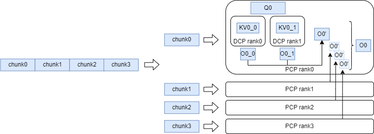
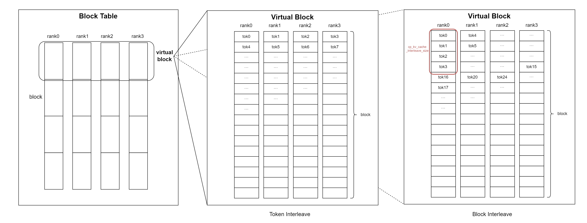
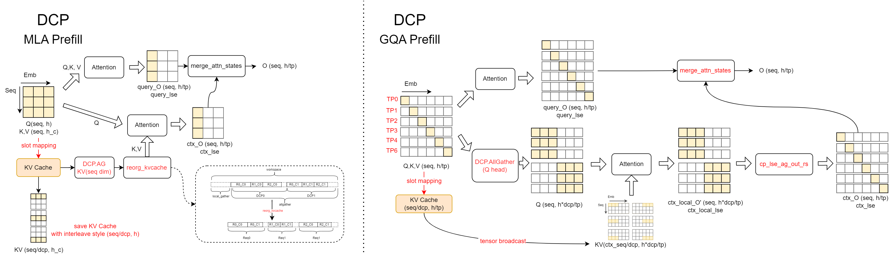
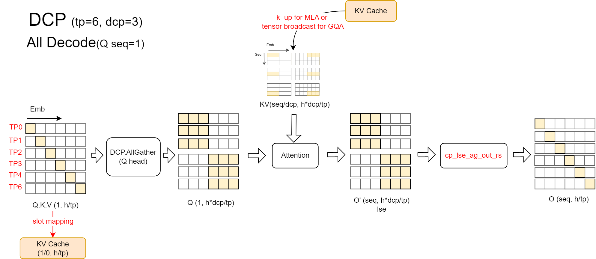
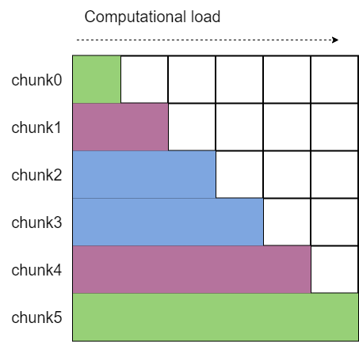
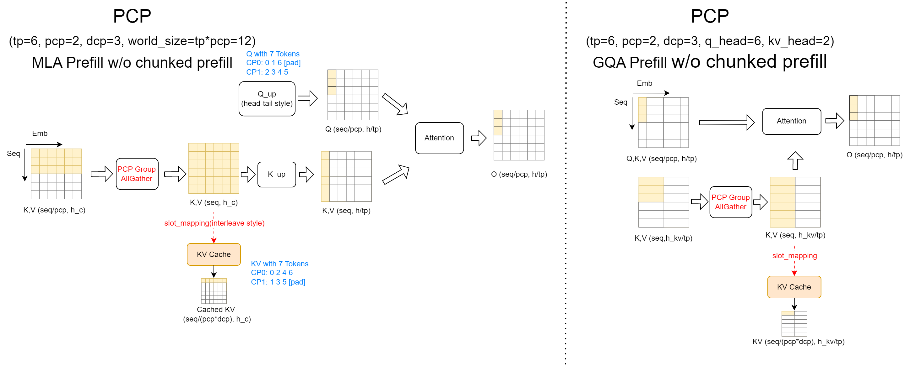
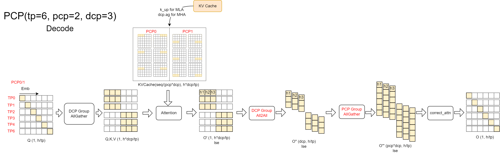
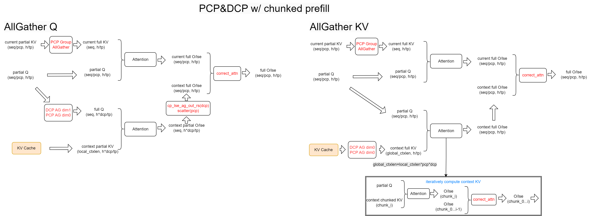

# Context Parallel (CP)

TL;DR PCP accelerates prefill via sequence splitting. DCP eliminates KV cache redundancy.

For the main discussions during the development process, please refer to the [RFC](https://github.com/vllm-project/vllm/issues/25749) and the relevant links referenced by or referencing this RFC.

## What is CP?

**Context Parallel (CP)** is a strategy for parallelizing computation along the sequence dimension across multiple devices.

**Prefill Context Parallel (PCP)** expands the world size of devices and uses dedicated communication domains.
Its primary goal is to partition the sequence dimension during the prefill phase, enabling different devices to compute distinct chunks of the sequence simultaneously.
The KV cache is sharded along the sequence dimension across devices.
This approach impacts the computational logic of both the Prefill and Decode stages to varying degrees.

**Decode Context Parallel (DCP)** reuses the communication domain of Tensor Parallelism (TP) and does not require additional devices.
Its main objective is to eliminate duplicated storage of the KV cache by sharding it along the sequence dimension across devices within the TP domain that would otherwise hold redundant copies.
DCP primarily influences the Decode logic, as well as the logic for chunked prefill and cached prefill.

## How to Use CP?
Please refer to the [context parallel user guide](../../user_guide/feature_guide/context_parallel.md) for detailed information.

## How It Works?

### Block Table

CP performs sequence sharding on the KV cache storage. To facilitate efficient storage and access, tokens are stored in an interleaved manner across devices, with the interleaving granularity determined by `cp_kv_cache_interleave_size`.

As illustrated, a virtual block is defined in the block table, where blocks within the same CP device group form a virtual block. The virtual block size is `virtual_block_size = block_size * pcp_size * dcp_size`.

For any token `x`, its (virtual) block index is `x // virtual_block_size`, and the offset within the virtual block is `x % virtual_block_size`. The local block index is `offset_within_virtual_block // cp_kv_cache_interleave_size`, and the device number is `local_block_index % (pcp_size * dcp_size)`. The offset within the local block is `(local_block_index // (pcp_size * dcp_size)) * cp_kv_cache_interleave_size + offset_within_virtual_block % cp_kv_cache_interleave_size`.

Based on the logic above, the `slot_mapping` calculation process is adjusted, and the `slot_mapping` values on each device are modified to ensure the KV cache is sharded along the sequence dimension and stored across different devices as expected.

The current implementation requires that `block_size % cp_kv_cache_interleave_size == 0`.

### Decode Context Parallel (DCP)

As mentioned above, the primary function of DCP is to shard the KV cache along the sequence dimension for storage. Its impact lies in the logic of the decode and chunked prefill phases.

**Prefill Phase:**  
As illustrated, during the Chunked Prefill computation, two distinct logic implementations are employed for MLA and GQA backends.  

- In the **MLA backend**, a Context KV Cache `all_gather` operation is performed to aggregate the full KV values.
These are then used for attention computation with the Q values of the current chunk.
Note that in multi-request scenarios, the directly gathered KV results are interleaved across requests.
The `reorg_kvcache` function is used to reorganize the KV cache, ensuring that the KV cache of the same request is stored contiguously.  

- In the **GQA backend**, an `all_gather` is performed along the head dimension for Q.
This is because DCP overlaps with the TP communication domain, and the Q heads within a DCP group differ.
However, they need to exchange results with the locally computed KV cache for online Softmax updates.
To ensure correctness during result updates, the Q values are synchronized across the DCP group via head-dimension `all_gather`.
During the result update process, `cp_lse_ag_out_rs` is invoked to aggregate `attn_output` and `attn_lse`, update the results, and perform a reduce-scatter operation on the outputs.
Alternatively, we can use an all-to-all communication to exchange the output and LSE results, followed by direct local updates. This approach aligns with the logic adapted for PCP compatibility.

**Decode Phase:**
The logic during the decode phase is consistent with that of GQA's chunked prefill: an all-gather operation is first performed along the Q head dimension to ensure consistency within the DCP group.
After computing the results with the local KV cache, the results are updated via the `cp_lse_ag_out_rs` function.

### Prefill Context Parallel (PCP)

**Tokens Partition in Head-Tail Style**

PCP requires splitting the input sequence and ensure balanced computational load across devices during the prefill phase.
We employ a head-tail style for splitting and concatenation: specifically, the sequence is first padded to a length of `2*pcp_size`, then divided into `2*pcp_size` equal parts.
The first part is merged with the last part, the second part with the second last part, and so on, thereby assigning computationally balanced chunks to each devices.
Additionally, since allgather aggregation of KV or Q results in interleaved chunks from different requests, we compute `pcp_allgather_restore_idx` to quickly restore the original order.

These logics are implemented in the function `_update_tokens_for_pcp`.

**Prefill Phase:**

During the Prefill phase (excluding chunked prefill), we employ an all-gather KV approach to address the issue of incomplete sequences on individual GPUs.
It is important to note that we only aggregate the KV values for the current layer at a time, and these are discarded immediately after use, avoiding excessive peak memory usage.
This method can also be directly applied to KV cache storage (since the KV cache partitioning method differs from PCP sequence partitioning, it is inevitable that each GPU requires a complete copy of the KV values).
All attention backends maintain consistency in this logic.

Note: While a Ring Attention approach could also facilitate information exchange with lower peak memory and enable computation-communication overlap, we prioritized the all-gather KV implementation after evaluating that the development complexity was high and the benefits of overlap were limited.

**Decode Phase:**

During the decode phase, we only need to add an allgather within the PCP group after the DCP all-to-all communication exchanges the output and LSE, before proceeding with the output update.

**Chunked Prefill:**

Currently, there are three viable approaches for Chunked Prefill compatibility: **AllGatherQ**, **AllGatherKV**, and **Ring-Attn**.
Since PCP performs sequence sharding on both the query sequence and the KV cache, we need to ensure that one side has complete information or employ a method like Ring-Attn to perform computations sequentially.
The advantages and disadvantages of Ring-Attn will not be elaborated here.

We have implemented the **AllGatherQ** approach in the GQA attention backend and the **AllGatherKV** approach in the MLA attention backend.
The workflow after **AllGatherQ** is identical to the decode phase, while the workflow after **AllGatherKV** is the same as the standard prefill phase.
For details, please refer to the diagram below; specific steps will not be repeated.

One important note: **AllGatherKV** may lead to significant peak memory usage when the context length becomes excessively long.
To mitigate this, we adopt a segmented processing strategy.
By predefining the maximum amount of KV cache processed per round, we sequentially complete the attention computation and online softmax updates for each segment.

### Related Files

- slot_mapping computation: `vllm_ascend/worker/block_table.py`
- sequences splitting and metadata prepare: `vllm_ascend/worker/model_runner_v1.py`
- GQA backend: `vllm_ascend/attention/attention_cp.py`
- MLA backend: `vllm_ascend/attention/mla_cp.py`
