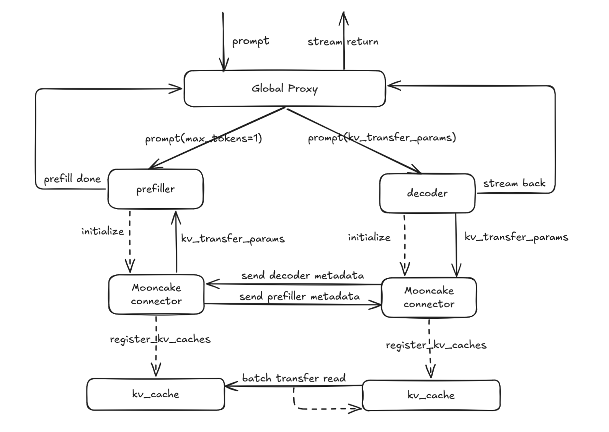
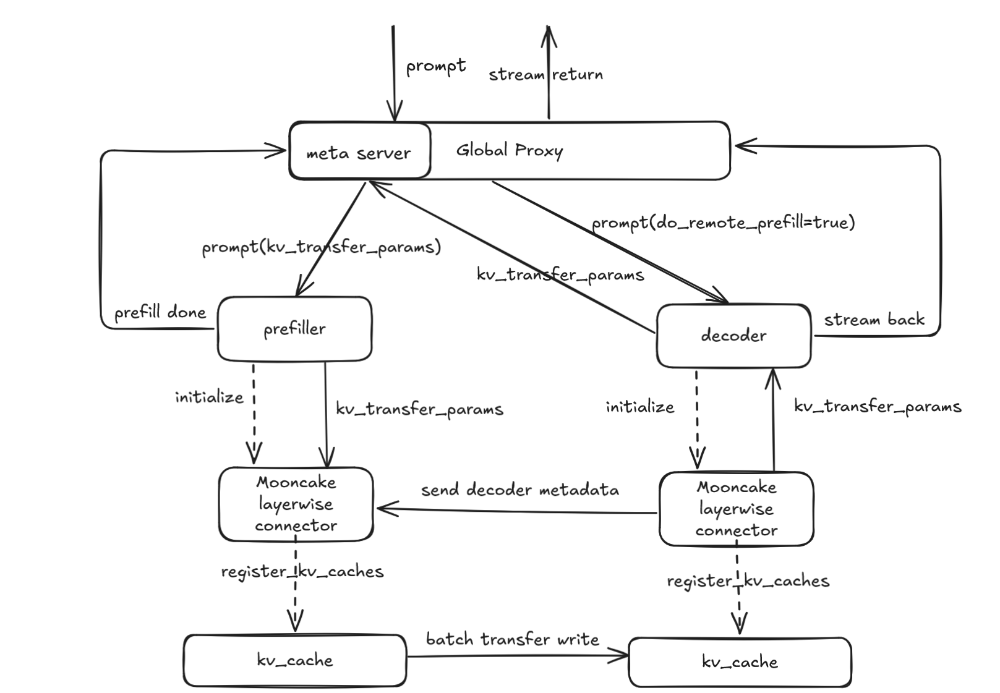

# Disaggregated-prefill

## Why disaggregated-prefill?

This feature addresses the need to optimize the **Time Per Output Token (TPOT)** and **Time To First Token (TTFT)** in large-scale inference tasks. The motivation is two-fold:

1. **Adjusting Parallel Strategy and Instance Count for P and D Nodes**  
   Using the disaggregated-prefill strategy, this feature allows the system to flexibly adjust the parallelization strategy (e.g., data parallelism (dp), tensor parallelism (tp), and expert parallelism (ep)) and the instance count for both P (Prefiller) and D (Decoder) nodes. This leads to better system performance tuning, particularly for **TTFT** and **TPOT**.

2. **Optimizing TPOT**  
   Without disaggregated-prefill strategy, prefill tasks are inserted during decoding, which results in inefficiencies and delays. disaggregated-prefill solves this by allowing for better control over the system’s **TPOT**. By managing chunked prefill tasks effectively, the system avoids the challenge of determining the optimal chunk size and provides more reliable control over the time taken for generating output tokens.

---

## Usage

vLLM Ascend currently supports two types of connectors for handling KV cache management:  
- **MooncakeConnector**: D nodes pull KV cache from P nodes.
- **MooncakeLayerwiseConnector**: P nodes push KV cache to D nodes in a layered manner.  

For step-by-step deployment and configuration, refer to the following guide:  
[https://docs.vllm.ai/projects/ascend/en/latest/tutorials/pd_disaggregation_mooncake_multi_node.html](https://docs.vllm.ai/projects/ascend/en/latest/tutorials/pd_disaggregation_mooncake_multi_node.html)

---

## How It Works

### 1. Design Approach

Under the disaggregated-prefill, a global proxy receives external requests, forwarding prefill to P nodes and decode to D nodes; the KV cache (key–value cache) is exchanged between P and D nodes via peer-to-peer (P2P) communication.

### 2. Implementation Design

Our design diagram is shown below, illustrating the pull and push schemes respectively.

#### Mooncake Connector:

1. The request is sent to the Proxy’s `_handle_completions` endpoint.
2. The Proxy calls `select_prefiller` to choose a P node and forwards the request, configuring `kv_transfer_params` with `do_remote_decode=True`, `max_tokens=1`, and `min_tokens=1`.
3. After the P node’s scheduler finishes prefill, `update_from_output` invokes the schedule connector’s `request_finished` to defer KV cache release, constructs `kv_transfer_params` with `do_remote_prefill=True`, and returns to the Proxy.
4. The Proxy calls `select_decoder` to choose a D node and forwards the request.
5. On the D node, the scheduler marks the request as `RequestStatus.WAITING_FOR_REMOTE_KVS`, pre-allocates KV cache, calls `kv_connector_no_forward` to pull the remote KV cache, then notifies the P node to release KV cache and proceeds with decoding to return the result.

#### Mooncake Layerwise Connector:

1. The request is sent to the Proxy’s `_handle_completions` endpoint.
2. The Proxy calls `select_decoder` to choose a D node and forwards the request, configuring `kv_transfer_params` with `do_remote_prefill=True` and setting the `metaserver` endpoint.
3. On the D node, the scheduler uses `kv_transfer_params` to mark the request as `RequestStatus.WAITING_FOR_REMOTE_KVS`, pre-allocates KV cache, then calls `kv_connector_no_forward` to send a request to the metaserver and waits for the KV cache transfer to complete.
4. The Proxy’s `metaserver` endpoint receives the request, calls `select_prefiller` to choose a P node, and forwards it with `kv_transfer_params` set to `do_remote_decode=True`, `max_tokens=1`, and `min_tokens=1`.
5. During processing, the P node’s scheduler pushes KV cache layer-wise; once all layers pushing is complete, it releases the request and notifies the D node to begin decoding.
6. The D node performs decoding and returns the result.

### 3. Interface Design

Taking MooncakeConnector as an example, the system is organized into three primary classes:
- **MooncakeConnector**: Base class that provides core interfaces.
- **MooncakeConnectorScheduler**: Interface for scheduling the connectors within the engine core, responsible for managing KV cache transfer requirements and completion.
- **MooncakeConnectorWorker**: Interface for managing KV cache registration and transfer in worker processes.

### 4. Specifications Design

This feature is flexible and supports various configurations, including setups with MLA and GQA models. It is compatible with A2 and A3 hardware configurations and facilitates scenarios involving both equal and unequal TP setups across multiple P and D nodes.

| Feature                       |      Status    |
|-------------------------------|----------------|
| A2                            | 🟢 Functional  |
| A3                            | 🟢 Functional  |
| equal TP configuration        | 🟢 Functional  |
| unequal TP configuration      | 🟢 Functional  |
| MLA                           | 🟢 Functional  |
| GQA                           | 🟢 Functional  |

- 🟢 Functional: Fully operational, with ongoing optimizations.
- 🔵 Experimental: Experimental support, interfaces and functions may change.
- 🚧 WIP: Under active development, will be supported soon.
- 🟡 Planned: Scheduled for future implementation (some may have open PRs/RFCs).
- 🔴 NO plan/Deprecated: No plan or deprecated by vLLM.

---

## DFX Analysis

### 1. Config Parameter Validation

Validate KV transfer config by checking whether the kv_connector type is supported and whether kv_connector_module_path exists and is loadable. On transfer failures, emit clear error logs for diagnostics.

### 2. Port Conflict Detection

Before startup, perform a port-usage check on configured ports (e.g., rpc_port, metrics_port, http_port/metaserver) by attempting to bind. If a port is already in use, fail fast and log an error.

### 3. PD Ratio Validation

Under non-symmetric PD scenarios, validate the P-to-D tp ratio against expected and scheduling constraints to ensure correct and reliable operation.

---

## Limitations

- Heterogeneous P and D nodes are not supported—for example, running P nodes on A2 and D nodes on A3.

- In non-symmetric TP configurations, only cases where the P nodes have a higher TP degree than the D nodes and the P TP count is an integer multiple of the D TP count are supported (i.e., P_tp > D_tp and P_tp % D_tp = 0).
