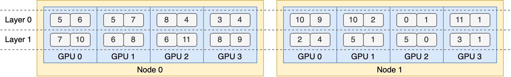

# Expert Parallelism Load Balancer (EPLB)

## Why We Need EPLB?
When using Expert Parallelism (EP), different experts are assigned to different NPUs. Given that the load of various experts may vary depending on the current workload, it is crucial to maintain balanced loads across different NPUs. We adopt a redundant experts strategy by duplicating heavily-loaded experts. Then, we heuristically pack these duplicated experts onto NPUs to ensure load balancing across them. Moreover, thanks to the group-limited expert routing used in MoE models, we also attempt to place experts of the same group on the same node to reduce inter-node data traffic, whenever possible.

To facilitate reproduction and deployment, Vllm Ascend supported deployed EP load balancing algorithm in `vllm_ascend/eplb/core/policy`. The algorithm computes a balanced expert replication and placement plan based on the estimated expert loads. Note that the exact method for predicting expert loads is outside the scope of this repository. A common method is to use a moving average of historical statistics.


## How to Use EPLB?
Please refer to the EPLB section of the user guide for detailed information: [How to Use EPLB](../../user_guide/feature_guide/eplb_swift_balancer.md)

## How It Works?
**EPLB Module Architecture**

```
vllm_ascend
├── eplb
│   ├── adaptor
│   │   ├── abstract_adaptor.py
│   │   ├── vllm_adaptor.py
│   ├── core
│   │   ├── policy
│   │   │   ├── policy_abstract.py
│   │   │   ├── policy_dynamic_ep.py
│   │   │   ├── policy_dynamic_ep_v2.py
│   │   │   ├── policy_factory.py
│   │   │   ├── policy_flashlb.py
│   │   ├── eplb_device_transfer_loader.py
│   │   ├── eplb_utils.py
│   │   ├── eplb_worker.py
│   ├── eplb_updator.py
│   ├── utils.py
└───────────
```

**1. Adaptor Module**  
*Handles registration and adaptation for different MoE model types*
- `abstract_adaptor.py`  
  Abstract base class defining unified registration interfaces for EPLB adapters
- `vllm_adaptor.py`  
  Implementation supporting Qwen3-MoE and DeepSeek models, standardizing parameter handling for policy algorithms

**2. Core Module**  
*Implements core algorithms, updates, and asynchronous processing*
- **Policy Submodule**  
  *Load balancing algorithms with factory pattern instantiation*
  - `policy_abstract.py`  
    Abstract class for load balancing strategy interfaces
  - `policy_dynamic_ep.py`  
    Default implementation of open-source EPLB paper algorithm
  - `policy_dynamic_ep_v2.py`  
    Enhanced version optimizing expert swaps for low-bandwidth devices (e.g., A2)
  - `policy_flashlb.py`  
    Threshold-based adjustment reducing operational costs through layer-wise fluctuation detection
  - `policy_factory.py`  
    Strategy factory for automatic algorithm instantiation

- `eplb_device_transfer_loader.py`  
  Manages expert table/weight transmission and updates
- `eplb_utils.py`  
  Utilities for expert table initialization and mapping
- `eplb_worker.py`  
  Asynchronous algorithm orchestration and result processing

**3. System Components**
- `eplb_updator.py`  
  Central coordinator for load balancing during inference workflows
- `utils.py`  
  General utilities for EPLB interface registration

*Key Optimizations:*
1. Maintained original structure while improving technical clarity
2. Standardized terminology
3. Enhanced algorithm differentiation through concise descriptors
4. Improved scoping through hierarchical presentation
5. Preserved file/class relationships while optimizing readability

### Default Algorithm
#### Hierarchical Load Balancing
When the number of server nodes evenly divides the number of expert groups, we use the hierarchical load balancing policy to leverage group-limited expert routing. We first pack the expert groups onto nodes evenly, ensuring balanced loads across different nodes. Then, we replicate the experts within each node. Finally, we pack the replicated experts onto individual NPUs to ensure load balancing across them. The hierarchical load balancing policy can be used in the prefilling stage with a smaller expert-parallel size.

#### Global Load Balancing
In other cases, we use the global load balancing policy, which replicates experts globally regardless of expert groups, and packs the replicated experts onto individual NPUs. This policy can be adopted in the decoding stage with a larger expert-parallel size.

### Add a New EPLB Policy
If you want to add a new eplb policy to vllm_ascend, you must follow these steps:
1. Inherit the `EplbPolicy` abstract class of `policy_abstract.py`  and override the `rebalance_experts` interface, ensuring consistent input parameters `current_expert_table`, `expert_workload` and return types `newplacement`.
For example:

```python
class RandomLoadBalance(EplbPolicy):

    def __init__(self, config: DynamicConfig):
        super().__init__(config)

    def rebalance_experts(self, current_expert_table, expert_workload):
        new_table = copy.deepcopy(current_expert_table)
        num_layers = len(current_expert_table)

        for i in range(num_layers):
            # randomly choose two card
            # indices = random.sample(range(num_card), 2)
            indices = [3, 1]

            # swap redundant experts
            expert_id_to_exchange = new_table[i][indices[0]][-1].clone()
            new_table[i][indices[0]][-1] = new_table[i][indices[1]][-1]
            new_table[i][indices[1]][-1] = expert_id_to_exchange

        return 1, [-i for i in range(num_layers)], new_table
```

2. To add a new EPLB algorithm, include the policy type and its corresponding implementation class in the `PolicyFactory` of `policy_factory.py`.

### Add a New MoE Model
**Implementation Guide for Model Integration**  

1. **Adapter File Modification**  
   - Inherit or modify `vllm_ascend/eplb/adaptor/vllm_adaptor.py`
   - Add processing logic for key parameters:
     - `num_dense_layers`
     - `global_expert_num`
     - `num_roe_layers`
   - Ensure parameter synchronization in the `model_register` function.

     For example:

     Modify `__init__` of `vllm_adaptor.py` to add a new moe model eplb params:

     ```python
        if self.model.config.model_type == "qwen3_moe":
         self.num_dense_layers = 0
         self.global_expert_num = self.model.config.num_experts
     ```

      Modify `model_register` of `vllm_adaptor.py` to register eplb params for new moe model:

     ```python
         if config.model_type == "qwen3_moe":
             model.num_moe_layers = config.num_hidden_layers
     ```

2. **MoE Feature Integration**  
   - Extend `vllm_ascend/eplb/utils.py` with MoE-specific methods  
   - Implement required functionality for expert routing or weight management  

3. **Registration Logic Update**  
   - Add patch logic within the `model_register` function  
   - Maintain backward compatibility with existing model types  

4. **Validation & Testing**  
   - Verify parameter consistency across layers  
   - Test cross-device communication for expert tables  
   - Benchmark against baseline implementations (e.g., Qwen3-MoE)  

*Key Implementation Notes:*  
- Preserve existing interface contracts in abstract classes  
- Use decorators for non-intrusive patch integration  
- Leverage `eplb_utils.py` for shared expert mapping operations
## DFX
### Parameter Validation
#### Integer Parameters
All integer input parameters must explicitly specify their maximum and minimum values and be subject to valid value validation. For example, `num_iterations_eplb_update` must be greater than 0:

```python
    @staticmethod
    def check_iterations(iterations):
        if not isinstance(iterations, int):
            raise TypeError(f"The {iterations} is not int.")
        if iterations <= 0:
            raise ValueError(
                f"The {iterations} can not less than or equal to 0.")
        if iterations > sys.maxsize:
            raise ValueError(
                f"The {iterations} can not large than {sys.maxsize}")
```

#### File Path
The file path for EPLB must be checked for legality, such as whether the file path is valid and whether it has appropriate read and write permissions. For example:

```python
    @staticmethod
    def check_expert_map_path(expert_map):
        if expert_map is None:
            return
        if not isinstance(expert_map, str):
            raise TypeError("The expert_map is not str.")
        if not expert_map.strip():
            raise ValueError("The expert_map is not empty.")
        _, ext = os.path.splitext(expert_map)
        if ext.lower() != ".json":
            raise TypeError("The expert_map is not json.")
        if not os.path.exists(expert_map):
            raise ValueError("The expert_map is not exist.")
        try:
            with open(expert_map, "w", encoding='utf-8') as f:
                f.read()
        except Exception as e:
            raise IOError(
                f"Fail read expert info from {expert_map}, please check the reading permission of {expert_map} : {e}"
            )

```

### Function Specifications
#### Initialization Function
All EPLB parameters must be initialized by default during initialization, with specified parameter types and default values for proper handling.

#### General Functions
All method arguments must specify parameter types and default values, and functions must include default return value handling for default arguments. It is recommended to use `try-except` blocks to handle the function body, specifying the type of exception captured and the failure handling (e.g., logging exceptions or returning a failure status).

### Consistency
#### Expert Map
The expert map must be globally unique during initialization and update. In a multi-node scenario during initialization, distributed communication should be used to verify the consistency of expert maps across each rank. If they are inconsistent, the user should be notified which ranks have inconsistent maps.
During the update process, if only a few layers or the expert table of a certain rank has been changed, the updated expert table must be synchronized with the EPLB's context to ensure global consistency.

#### Expert Weight
When updating expert weights, ensure that the memory allocated for the expert weights has been released, or that the expert (referring to the old version) is no longer in use.

## Limitation
Before using EPLB, start the script and add `export DYNAMIC_EPLB="true"`.
Before performing load data collection (or performance data collection), start the script and add `export EXPERT_MAP_RECORD="true"`.
