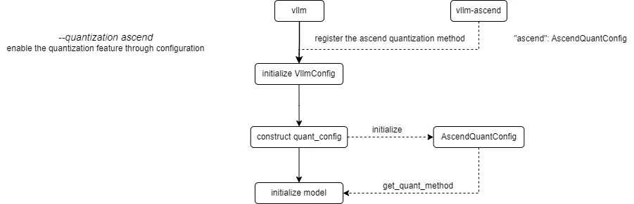
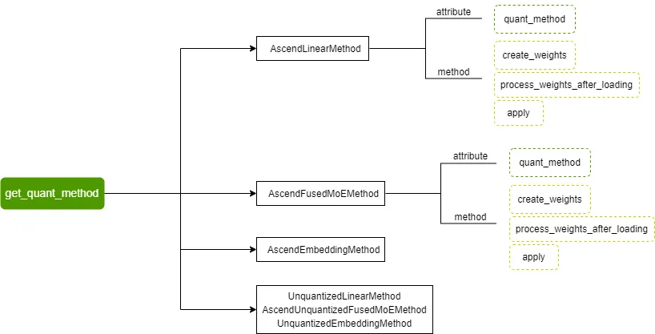
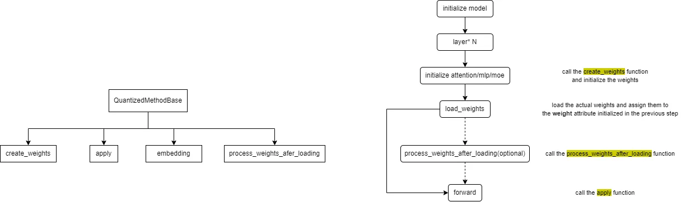

# Quantization Adaptation Guide

This document provides guidance for adapting quantization algorithms and models related to **ModelSlim**.

## Quantization Feature Introduction

### Quantization Inference Process

The current process for registering and obtaining quantization methods in vLLM Ascend is as follows:



vLLM Ascend registers a custom Ascend quantization method. By configuring the `--quantization ascend` parameter (or `quantization="ascend"` for offline), the quantization feature is enabled. When constructing the `quant_config`, the registered `AscendModelSlimConfig` is initialized and `get_quant_method` is called to obtain the quantization method corresponding to each weight part, stored in the `quant_method` attribute.

Currently supported quantization methods include `AscendLinearMethod`, `AscendFusedMoEMethod`, `AscendEmbeddingMethod`, and their corresponding non-quantized methods:



The quantization method base class defined by vLLM  and the overall call flow of quantization methods are as follows:



The `embedding` method is generally not implemented for quantization, focusing only on the other three methods.

The `create_weights` method is used for weight initialization; the `process_weights_after_loading` method is used for weight post-processing, such as transposition, format conversion, data type conversion, etc.; the `apply` method is used to perform activation quantization and quantized matrix multiplication calculations during the forward process.

We need to implement the `create_weights`, `process_weights_after_loading`, and `apply` methods for different **layers** (**attention**, **mlp**, **moe**).

**Supplement**: When loading the model, the quantized model's description file **quant_model_description.json** needs to be read. This file describes the quantization configuration and parameters for each part of the model weights, for example:

```json
{
    "model.layers.0.linear_attn.dt_bias": "FLOAT",
    "model.layers.0.linear_attn.A_log": "FLOAT",
    "model.layers.0.linear_attn.conv1d.weight": "FLOAT",
    "model.layers.0.linear_attn.in_proj_qkvz.weight": "W8A8_DYNAMIC",
    "model.layers.0.linear_attn.in_proj_qkvz.weight_scale": "W8A8_DYNAMIC",
    "model.layers.0.linear_attn.in_proj_qkvz.weight_offset": "W8A8_DYNAMIC",
    "model.layers.0.linear_attn.in_proj_ba.weight": "FLOAT",
    "model.layers.0.linear_attn.norm.weight": "FLOAT",
    "model.layers.0.linear_attn.out_proj.weight": "FLOAT",
    "model.layers.0.mlp.gate.weight": "FLOAT",
    "model.layers.0.mlp.experts.0.gate_proj.weight": "W8A8_DYNAMIC",
    "model.layers.0.mlp.experts.0.gate_proj.weight_scale": "W8A8_DYNAMIC",
    "model.layers.0.mlp.experts.0.gate_proj.weight_offset": "W8A8_DYNAMIC",
}
```

Based on the above content, we present a brief description of the adaptation process for quantization algorithms and quantized models.

### Quantization Algorithm Adaptation

- **Step 1: Algorithm Design**. Define the algorithm ID (e.g., `W4A8_DYNAMIC`), determine supported layers (linear, moe, attention), and design the quantization scheme (static/dynamic, pertensor/perchannel/pergroup).
- **Step 2: Registration**. Use the `@register_scheme` decorator in `vllm_ascend/quantization/methods/registry.py` to register your quantization scheme class.

```python
from vllm_ascend.quantization.methods import register_scheme, AscendLinearScheme

@register_scheme("W4A8_DYNAMIC", "linear")
class AscendW4A8DynamicLinearMethod(AscendLinearScheme):
    ...

@register_scheme("W4A8_DYNAMIC", "moe")
class AscendW4A8DynamicFusedMoEMethod(AscendMoEScheme):
    ...
```

- **Step 3: Implementation**. Create an algorithm implementation file, such as `vllm_ascend/quantization/methods/w4a8.py`, and implement the method class and logic.
- **Step 4: Testing**. Use your algorithm to generate quantization configurations and verify correctness and performance on target models and hardware.

### Quantized Model Adaptation

Adapting a new quantized model requires ensuring the following three points:

- The original model has been successfully adapted in `vLLM Ascend`.
- **Fused Module Mapping**: Add the model's `model_type` to `packed_modules_model_mapping` in `vllm_ascend/quantization/modelslim_config.py` (e.g., `qkv_proj`, `gate_up_proj`, `experts`) to ensure sharding consistency and correct loading.

```python
packed_modules_model_mapping = {
    "qwen3_moe": {
        "qkv_proj": [
            "q_proj",
            "k_proj",
            "v_proj",
        ],
        "gate_up_proj": [
            "gate_proj",
            "up_proj",
        ],
        "experts":
        ["experts.0.gate_proj", "experts.0.up_proj", "experts.0.down_proj"],
    },
}
```

- All quantization algorithms used by the quantized model have been integrated into the `quantization` module.

## Currently Supported Quantization Algorithms

vLLM Ascend supports multiple quantization algorithms. The following table provides an overview of each quantization algorithm based on the implementation in the `vllm_ascend.quantization` module:

| Algorithm                | Weight | Activation | Weight Granularity | Activation Granularity | Type    | Description                                                                                                                                                        |
| ------------------------ | ------ | ---------- | ------------------ | ---------------------- | ------- | ------------------------------------------------------------------------------------------------------------------------------------------------------------------ |
| `W4A16`                  | INT4   | FP16/BF16  | Per-Group          | Per-Tensor             | Static  | 4-bit weight quantization with 16-bit activation precision, specifically designed for MoE model expert layers, supporting int32 format weight packing              |
| `W8A16`                  | INT8   | FP16/BF16  | Per-Channel        | Per-Tensor             | Static  | 8-bit weight quantization with 16-bit activation precision, balancing accuracy and performance, suitable for linear layers                                         |
| `W8A8`                   | INT8   | INT8       | Per-Channel        | Per-Tensor             | Static  | Static activation quantization, suitable for scenarios requiring high precision                                                                                    |
| `W8A8_DYNAMIC`           | INT8   | INT8       | Per-Channel        | Per-Token              | Dynamic | Dynamic activation quantization with per-token scaling factor calculation                                                                                          |
| `W4A8_DYNAMIC`           | INT4   | INT8       | Per-Group          | Per-Token              | Dynamic | Supports both direct per-channel quantization to 4-bit and two-step quantization (per-channel to 8-bit then per-group to 4-bit)                                    |
| `W4A4_FLATQUANT_DYNAMIC` | INT4   | INT4       | Per-Channel        | Per-Token              | Dynamic | Uses FlatQuant for activation distribution smoothing before 4-bit dynamic quantization, with additional matrix multiplications for precision preservation          |
| `W8A8_MIX`               | INT8   | INT8       | Per-Channel        | Per-Tensor/Token       | Mixed   | PD Colocation Scenario uses dynamic quantization for both P node and D node; PD Disaggregation Scenario uses dynamic quantization for P node and static for D node |

**Static vs Dynamic:** Static quantization uses pre-computed scaling factors with better performance, while dynamic quantization computes scaling factors on-the-fly for each token/activation tensor with higher precision.

**Granularity:** Refers to the scope of scaling factor computation (e.g., per-tensor, per-channel, per-group).
