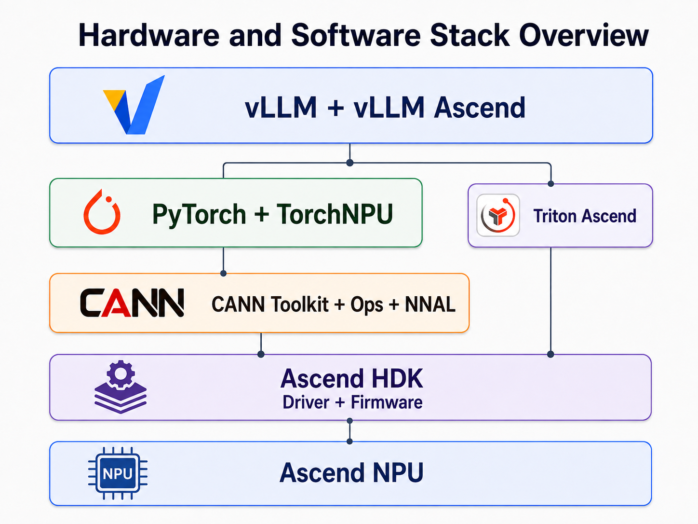

# Installation Guide

This document describes how to install vllm-ascend manually.

## Requirements {: #installation-requirements }

### Environment requirements {: #installation-environment-requirements }

- Operating system: Linux
- Python: {{ release_python_version }}
- Hardware equipped with Ascend NPUs. This guide supports the following devices:



### Hardware and software stack {: #installation-hardware-software-stack }

vLLM Ascend runs on a layered hardware and software stack. The following overview shows how the main runtime components fit together.

??? note "Hardware and software stack overview"

    <p align="center">
      
    </p>

The following hardware and software stack is validated together for this release:

???+ important "Validated hardware and software stack"

    | Layer | Component | Validated version / requirement | Role |
    | --- | --- | --- | --- |
    | Runtime environment | Python | `{{ release_image_python_version }}` | Python version used by the validated release image |
    | Host enablement | Ascend HDK | 26.0.RC1 | Driver and firmware requirements for the selected CANN release |
    | Ascend runtime | CANN Toolkit + Ops | `{{ release_cann_version }}` | Ascend user-space runtime, including the CANN Toolkit and hardware-specific Ops packages |
    | Ascend runtime | NNAL | `{{ release_nnal_version }}` | Provides `libatb.so` and ATB runtime capabilities |
    | Framework | PyTorch | `{{ release_pytorch_version }}` | Tensor framework used by vLLM |
    | Framework | TorchNPU | `{{ release_torch_npu_version }}` | Connects PyTorch to the Ascend runtime |
    | Kernel acceleration | Triton Ascend | `{{ release_triton_ascend_version }}` | Used on A2, A3, and 950DT; not used on Atlas 300I DUO or Atlas 200I Pro |
    | Inference engine | vLLM | `{{ release_vllm_version }}` | Model inference engine |
    | Hardware plugin | vLLM Ascend | `{{ release_vllm_ascend_version }}` | Connects vLLM to the Ascend software stack |

    The versions and requirements in the table above are validated as one compatibility set. Do not arbitrarily mix versions from different releases.

    For another release, select a complete row from [Versioning Policy > Release compatibility matrix](../community/versioning_policy.md#release-compatibility-matrix).

## Installation {: #installation }

### Set up the hardware environment {: #installation-hardware-environment }

First, run the following command to confirm that the Ascend NPU firmware and driver are installed correctly:

```bash
npu-smi info
```

For more information, see the [CANN installation resources](https://www.hiascend.com/cann/download?versionId=735&ids=d806%2Ch0501%2Ch0601%2Ch0702).

### Set up the software environment {: #installation-software-environment }

Choose one complete path based on your requirements. Container-based paths require Docker; see the [Docker installation guide](https://docs.docker.com/get-started/get-docker/) if needed.

| Requirement | Recommended method | Intended users |
| --- | --- | --- |
| Get a working vLLM Ascend environment as quickly as possible | **Use a prebuilt image** | First-time users or users who want a quick deployment |
| Install vLLM Ascend on an existing CANN environment | **Install in a CANN environment** | Users of a CANN image or a host/container where CANN is already installed |
| Install and manage the complete software stack manually | **Install from a base environment** | Advanced users who need custom CANN or Python dependencies, development, or debugging |

??? tip "Components by installation method"

    **Status:** **✓ Already available** · **○ Installed during this path**

    | Component | Prebuilt image | CANN environment | Base environment |
    | --- | :---: | :---: | :---: |
    | CANN Toolkit + Ops | ✓ | ✓ | ○ |
    | NNAL | ✓ | ✓ | ○ |
    | PyTorch + TorchNPU | ✓ | ○ | ○ |
    | vLLM + vLLM Ascend | ✓ | ○ | ○ |
    | Triton Ascend | ✓ | ○ | ○ |

    - **PyTorch and TorchNPU:** Installed as dependencies during the **Install vLLM and vLLM Ascend** step; no separate installation step is required.
    - **Triton Ascend:** Installed only for A2, A3, and 950DT; it is not used on Atlas 300I DUO or Atlas 200I Pro.







### Verify the installation {: #installation-verification }

Go to [Quick Start > Inference](quick_start.md#quick-start-inference) and run a simple inference test to verify the installation.

## Additional guides {: #installation-more }

### CPU-only build verification {: #installation-cpu-build }

CPU-only build verification checks whether the Python package can be built without a visible Ascend device. It does not verify NPU runtime loading, inference examples, custom kernels, or NPU-specific tests. The build process needs access to CANN Toolkit headers and libraries, so CANN Toolkit must still be installed.

First, install the Python build backend and native build tools. Editable installations use setuptools-scm directly. If no compatible wheel is available, `arctic-inference` also requires CMake and Ninja:

```bash
python -m pip install --upgrade \
    pip "setuptools>=64" "setuptools-scm>=8" wheel \
    attrs googleapis-common-protos \
    "cmake>=3.26" ninja
```

This workflow verifies only the build and therefore does not install vLLM. To continue testing vLLM and vLLM Ascend together on the main branch, use the exact vLLM commit recorded in `.github/vllm-main-verified.commit` and verify the combined environment as described below.

In an x86 environment, install the CPU version of PyTorch from the PyTorch CPU index before installing the remaining Ascend dependencies:

```bash
python -m pip install \
    --index-url https://download.pytorch.org/whl/cpu/ \
    torch=={{ main_pytorch_version }} torchvision=={{ main_torchvision_version }} torchaudio=={{ main_torchaudio_version }}
python -m pip install \
    --extra-index-url https://mirrors.huaweicloud.com/ascend/repos/pypi \
    torch-npu=={{ main_torch_npu_version }} triton-ascend=={{ main_triton_ascend_version }}
python -m pip install \
    --extra-index-url https://mirrors.huaweicloud.com/ascend/repos/pypi \
    -r requirements.txt
```

Before building vLLM Ascend, explicitly set the build target and disable automatic device backend loading:

???+ important "Set the correct SOC_VERSION when no NPU is visible"

    If `npu-smi` is unavailable in the current environment, set `SOC_VERSION` for the target hardware before running `pip install -e .`:

    - A2: `export SOC_VERSION=ascend910b1`
    - A3: `export SOC_VERSION=ascend910_9391`
    - Atlas 300I DUO / Atlas 200I Pro: `export SOC_VERSION=ascend310p1`
    - 950DT: `export SOC_VERSION=ascend950dt_9582`

???+ tip "Enable batch invariance"

    To enable batch invariance, set `VLLM_BATCH_INVARIANT=1` before building vLLM Ascend so that the custom operator library for batch invariance is installed during installation. For usage instructions, see [Batch Invariance](../user_guide/feature_guide/batch_invariance.md).

```bash
export ASCEND_TOOLKIT_HOME="${ASCEND_TOOLKIT_HOME:-/usr/local/Ascend/ascend-toolkit/latest}"
export TORCH_DEVICE_BACKEND_AUTOLOAD=0
export COMPILE_CUSTOM_KERNELS=0
export SOC_VERSION=ascend910b1  # A2
python -m pip install \
    --no-build-isolation \
    --no-deps \
    --extra-index-url https://mirrors.huaweicloud.com/ascend/repos/pypi \
    -e .
```

The explicit build dependencies above and `requirements.txt` provide the complete build-system dependencies before the non-isolated editable build starts. `--no-build-isolation` only reuses packages in the current build environment; it cannot make incompatible vLLM, PyTorch, and TorchNPU versions compatible. Before using the environment for actual workloads, run `python -m pip check` and resolve all reported conflicts. If no device is available, skip the inference examples and NPU-specific tests.

???+ note

    Building custom operators requires gcc/g++ later than version 8 and C++17 or later. If you encounter a TorchNPU version conflict when running `pip install -e .`, use `pip install --no-build-isolation -e .` instead to build in the system environment.

    If you encounter other compilation issues, an unexpected compiler may be in use. Before compiling, set `CXX_COMPILER` and `C_COMPILER` to the locations of g++ and gcc, respectively.

### Multi-node deployment {: #installation-multi-node }

Check the physical links, the status of each node, and inter-node connectivity in order.

#### Physical link requirements {: #installation-multi-node-physical }

- The physical machines must be on the same LAN and able to communicate with each other.
- All NPUs must be connected through optical modules, and all connections must be healthy.

???+ important "950DT server precheck"

    This precheck applies only to 950DT servers. Other server series can skip it.

    **Prepare the HiXLEP configuration paths**:

    - When deploying a 950DT inference service, confirm on each server that `/lib/route.conf`, `/etc/hccl_rootinfo.json`, and the `/etc/hixlep` directory that describes the UB link topology exist and are configured correctly. If any item is missing or misconfigured, follow the [HiXLEP configuration file generation guide](https://gitcode.com/cann/hixl/wiki/A5%20LocalCommRes%E9%85%8D%E7%BD%AE%E6%8C%87%E5%8D%97.md) to generate the required content. Select the "D2D scenario" when generating `/etc/hixlep`.

#### Check each node {: #installation-multi-node-node-check }

Run the following commands on each node in order. The command results should be `success`, and the link status should be `UP`:

=== "A2"

    ```bash
    # Check the remote switch ports
    for i in {0..7}; do hccn_tool -i $i -lldp -g | grep Ifname; done
    # Get the link status of the Ethernet ports (UP or DOWN)
    for i in {0..7}; do hccn_tool -i $i -link -g ; done
    # Check the network health status
    for i in {0..7}; do hccn_tool -i $i -net_health -g ; done
    # View the network detected IP configuration
    for i in {0..7}; do hccn_tool -i $i -netdetect -g ; done
    # View gateway configuration
    for i in {0..7}; do hccn_tool -i $i -gateway -g ; done
    # View NPU network configuration
    cat /etc/hccn.conf
    ```

=== "A3"

    ```bash
    # Check the remote switch ports
    for i in {0..15}; do hccn_tool -i $i -lldp -g | grep Ifname; done
    # Get the link status of the Ethernet ports (UP or DOWN)
    for i in {0..15}; do hccn_tool -i $i -link -g ; done
    # Check the network health status
    for i in {0..15}; do hccn_tool -i $i -net_health -g ; done
    # View the network detected IP configuration
    for i in {0..15}; do hccn_tool -i $i -netdetect -g ; done
    # View gateway configuration
    for i in {0..15}; do hccn_tool -i $i -gateway -g ; done
    # View NPU network configuration
    cat /etc/hccn.conf
    ```

=== "950DT"

    ```bash
    # Check the remote switch ports
    for i in {0..7}; do hccn_tool -i $i -lldp -g | grep Ifname; done
    # Get the link status of the Ethernet ports (UP or DOWN)
    for i in {0..7}; do hccn_tool -i $i -link -g ; done
    # Check the network health status
    for i in {0..7}; do hccn_tool -i $i -net_health -g ; done
    # View the network detected IP configuration
    for i in {0..7}; do hccn_tool -i $i -netdetect -g ; done
    # View gateway configuration
    for i in {0..7}; do hccn_tool -i $i -gateway -g ; done
    # View NPU network configuration
    cat /etc/hccn.conf
    ```

#### Verify inter-node connectivity {: #installation-multi-node-interconnect }

##### Obtain NPU IP addresses {: #installation-multi-node-npu-ip }

=== "A2"

    ```bash
    for i in {0..7}; do hccn_tool -i $i -ip -g | grep ipaddr; done
    ```

=== "A3"

    ```bash
    for i in {0..15}; do hccn_tool -i $i -ip -g | grep ipaddr; done
    ```

=== "950DT"

    ```bash
    for i in {0..7}; do hccn_tool -i $i -ip -g | grep ipaddr; done
    ```

##### Run a cross-node ping test {: #installation-multi-node-ping }

```bash
# Execute on the target node (replace with actual IP)
hccn_tool -i 0 -ping -g address x.x.x.x
```

#### Start containers on each node {: #installation-multi-node-container }

- Use the official vLLM Ascend containers described in [Quick Start > Installation](quick_start.md#quick-start-installation) to quickly prepare consistent multi-node runtime environments.

- Commands for multi-node model serving are outside the scope of this installation guide. Continue with the relevant [Feature Tutorial](../tutorials/features/index.md) or [Model Tutorial](../tutorials/models/index.md).
