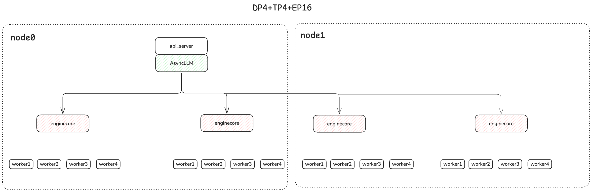

# Multi-Node-DP (DeepSeek)

## Getting Start
vLLM-Ascend now supports Data Parallel (DP) deployment, enabling model weights to be replicated across multiple NPUs or instances, each processing independent batches of requests. This is particularly useful for scaling throughput across devices while maintaining high resource utilization.

Each DP rank is deployed as a separate “core engine” process which communicates with front-end process(es) via ZMQ sockets. Data Parallel can be combined with Tensor Parallel, in which case each DP engine owns a number of per-NPU worker processes equal to the TP size.

For Mixture-of-Experts (MoE) models — especially advanced architectures like DeepSeek that utilize Multi-head Latent Attention (MLA) — a hybrid parallelism approach is recommended:

- Use **Data Parallelism (DP)** for attention layers, which are replicated across devices and handle separate batches.
- Use **Expert or Tensor Parallelism (EP/TP)** for expert layers, which are sharded across devices to distribute the computation.

This division enables attention layers to be replicated across Data Parallel (DP) ranks, enabling them to process different batches independently. Meanwhile, expert layers are partitioned (sharded) across devices using Expert or Tensor Parallelism(DP*TP), maximizing hardware utilization and efficiency.

In these cases the data parallel ranks are not completely independent, forward passes must be aligned and expert layers across all ranks are required to synchronize during every forward pass, even if there are fewer requests to be processed than DP ranks.

For MoE models, when any requests are in progress in any rank, we must ensure that empty “dummy” forward passes are performed in all ranks which don’t currently have any requests scheduled. This is handled via a separate DP `Coordinator` process which communicates with all of the ranks, and a collective operation performed every N steps to determine when all ranks become idle and can be paused. When TP is used in conjunction with DP, expert layers form an EP or TP group of size (DP x TP).

## Verify Multi-Node Communication Environment

### Physical Layer Requirements:

- The physical machines must be located on the same WLAN, with network connectivity.
- All NPUs are connected with optical modules, and the connection status must be normal.

### Verification Process:

Execute the following commands on each node in sequence. The results must all be `success` and the status must be `UP`:

```bash
 # Check the remote switch ports
 for i in {0..7}; do hccn_tool -i $i -lldp -g | grep Ifname; done 
 # Get the link status of the Ethernet ports (UP or DOWN)
 for i in {0..7}; do hccn_tool -i $i -link -g ; done
 # Check the network health status
 for i in {0..7}; do hccn_tool -i $i -net_health -g ; done
 # View the network detected IP configuration
 for i in {0..7}; do hccn_tool -i $i -netdetect -g ; done
 # View gateway configuration
 for i in {0..7}; do hccn_tool -i $i -gateway -g ; done
 # View NPU network configuration
 cat /etc/hccn.conf
```

### NPU Interconnect Verification:
#### 1. Get NPU IP Addresses

```bash
for i in {0..7}; do hccn_tool -i $i -ip -g | grep ipaddr; done
```

#### 2. Cross-Node PING Test

```bash
# Execute on the target node (replace with actual IP)
hccn_tool -i 0 -ping -g address 10.20.0.20
```

## Run with docker
Assume you have two Atlas 800 A2(64G*8) nodes, and want to deploy the `deepseek-v3.1-w8a8` quantitative model across multi-node.

```{code-block} bash
   :substitutions:
# Update the vllm-ascend image
export IMAGE=m.daocloud.io/quay.io/ascend/vllm-ascend:|vllm_ascend_version|
export NAME=vllm-ascend

# Run the container using the defined variables
# Note if you are running bridge network with docker, Please expose available ports for multiple nodes communication in advance
docker run --rm \
--name $NAME \
--net=host \
--device /dev/davinci0 \
--device /dev/davinci1 \
--device /dev/davinci2 \
--device /dev/davinci3 \
--device /dev/davinci4 \
--device /dev/davinci5 \
--device /dev/davinci6 \
--device /dev/davinci7 \
--device /dev/davinci_manager \
--device /dev/devmm_svm \
--device /dev/hisi_hdc \
-v /usr/local/dcmi:/usr/local/dcmi \
-v /usr/local/Ascend/driver/tools/hccn_tool:/usr/local/Ascend/driver/tools/hccn_tool \
-v /usr/local/bin/npu-smi:/usr/local/bin/npu-smi \
-v /usr/local/Ascend/driver/lib64/:/usr/local/Ascend/driver/lib64/ \
-v /usr/local/Ascend/driver/version.info:/usr/local/Ascend/driver/version.info \
-v /etc/ascend_install.info:/etc/ascend_install.info \
-v /mnt/sfs_turbo/.cache:/root/.cache \
-it $IMAGE bash
```

Run the following scripts on two nodes respectively

:::{note}
Before launch the inference server, ensure the following environment variables are set for multi node communication
:::

**node0**

```shell
#!/bin/sh

# this obtained through ifconfig
# nic_name is the network interface name corresponding to local_ip
nic_name="xxxx"
local_ip="xxxx"

export VLLM_USE_MODELSCOPE=True
export HCCL_IF_IP=$local_ip
export GLOO_SOCKET_IFNAME=$nic_name
export TP_SOCKET_IFNAME=$nic_name
export HCCL_SOCKET_IFNAME=$nic_name
export OMP_PROC_BIND=false
export OMP_NUM_THREADS=100
export HCCL_BUFFSIZE=1024

# The w8a8 weight can obtained from https://www.modelscope.cn/models/vllm-ascend/DeepSeek-V3.1-W8A8
# If you want to the quantization manually, please refer to https://vllm-ascend.readthedocs.io/en/latest/user_guide/feature_guide/quantization.html
vllm serve vllm-ascend/DeepSeek-V3.1-W8A8 \
--host 0.0.0.0 \
--port 8004 \
--data-parallel-size 4 \
--data-parallel-size-local 2 \
--data-parallel-address $local_ip \
--data-parallel-rpc-port 13389 \
--tensor-parallel-size 4 \
--seed 1024 \
--served-model-name deepseek_v3.1 \
--enable-expert-parallel \
--max-num-seqs 16 \
--max-model-len 32768 \
--quantization ascend \
--max-num-batched-tokens 4096 \
--trust-remote-code \
--no-enable-prefix-caching \
--gpu-memory-utilization 0.9 \
--additional-config '{"ascend_scheduler_config":{"enabled":true},"torchair_graph_config":{"enabled":true}}'
```

**node1**

```shell
#!/bin/sh

nic_name="xxx"
local_ip="xxx"

export VLLM_USE_MODELSCOPE=True
export HCCL_IF_IP=$local_ip
export GLOO_SOCKET_IFNAME=$nic_name
export TP_SOCKET_IFNAME=$nic_name
export HCCL_SOCKET_IFNAME=$nic_name
export OMP_PROC_BIND=false
export OMP_NUM_THREADS=100
export VLLM_USE_V1=1
export HCCL_BUFFSIZE=1024

vllm serve vllm-ascend/DeepSeek-V3.1-W8A8 \
--host 0.0.0.0 \
--port 8004 \
--headless \
--data-parallel-size 4 \
--data-parallel-size-local 2 \
--data-parallel-start-rank 2 \
--data-parallel-address { node0 ip } \
--data-parallel-rpc-port 13389 \
--tensor-parallel-size 4 \
--seed 1024 \
--quantization ascend \
--served-model-name deepseek_v3.1 \
--max-num-seqs 16 \
--max-model-len 32768 \
--max-num-batched-tokens 4096 \
--enable-expert-parallel \
--trust-remote-code \
--no-enable-prefix-caching \
--gpu-memory-utilization 0.92 \
--additional-config '{"ascend_scheduler_config":{"enabled":true},"torchair_graph_config":{"enabled":true}}'
```

The Deployment view looks like:


Once your server is started, you can query the model with input prompts:

```shell
curl http://{ node0 ip:8004 }/v1/completions \
    -H "Content-Type: application/json" \
    -d '{
        "model": "deepseek_v3.1",
        "prompt": "The future of AI is",
        "max_tokens": 50,
        "temperature": 0
    }'
```

## Run benchmarks
For details please refer to [benchmark](https://github.com/vllm-project/vllm-ascend/tree/main/benchmarks)

```shell
export VLLM_USE_MODELSCOPE=true
vllm bench serve --model vllm-ascend/DeepSeek-V3.1-W8A8  --served-model-name deepseek_v3.1 \
--dataset-name random --random-input-len 128 --random-output-len 128 \
--num-prompts 200  --trust-remote-code --base-url "http://{ node0 ip }:8004" --request-rate 1
```
