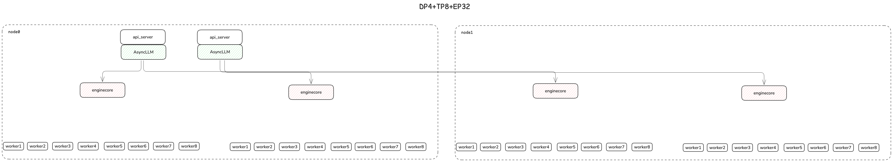

# Multi-Node-DP (Kimi-K2)

## Verify Multi-Node Communication Environment

Refer to [multi_node.md](https://vllm-ascend.readthedocs.io/en/latest/tutorials/multi_node.html#verification-process).

## Run with Docker
Assume you have two Atlas 800 A3 (64G*16) or four A2 nodes, and want to deploy the `Kimi-K2-Instruct-W8A8` quantitative model across multiple nodes.

```{code-block} bash
   :substitutions:
# Update the vllm-ascend image
export IMAGE=m.daocloud.io/quay.io/ascend/vllm-ascend:|vllm_ascend_version|
export NAME=vllm-ascend

# Run the container using the defined variables
# Note: If you are running bridge network with docker, please expose available ports for multiple nodes communication in advance
docker run --rm \
--name $NAME \
--net=host \
--shm-size=1g \
--device /dev/davinci0 \
--device /dev/davinci1 \
--device /dev/davinci2 \
--device /dev/davinci3 \
--device /dev/davinci4 \
--device /dev/davinci5 \
--device /dev/davinci6 \
--device /dev/davinci7 \
--device /dev/davinci8 \
--device /dev/davinci9 \
--device /dev/davinci10 \
--device /dev/davinci11 \
--device /dev/davinci12 \
--device /dev/davinci13 \
--device /dev/davinci14 \
--device /dev/davinci15 \
--device /dev/davinci_manager \
--device /dev/devmm_svm \
--device /dev/hisi_hdc \
-v /usr/local/dcmi:/usr/local/dcmi \
-v /usr/local/Ascend/driver/tools/hccn_tool:/usr/local/Ascend/driver/tools/hccn_tool \
-v /usr/local/bin/npu-smi:/usr/local/bin/npu-smi \
-v /usr/local/Ascend/driver/lib64/:/usr/local/Ascend/driver/lib64/ \
-v /usr/local/Ascend/driver/version.info:/usr/local/Ascend/driver/version.info \
-v /etc/ascend_install.info:/etc/ascend_install.info \
-v /mnt/sfs_turbo/.cache:/home/cache \
-it $IMAGE bash
```

Run the following scripts on two nodes respectively.

:::{note}
Before launching the inference server, ensure the following environment variables are set for multi-node communication.
:::

**Node 0**

```shell
#!/bin/sh

# this obtained through ifconfig
# nic_name is the network interface name corresponding to local_ip of the current node
nic_name="xxxx"
local_ip="xxxx"

export HCCL_IF_IP=$local_ip
export GLOO_SOCKET_IFNAME=$nic_name
export TP_SOCKET_IFNAME=$nic_name
export HCCL_SOCKET_IFNAME=$nic_name
export OMP_PROC_BIND=false
export OMP_NUM_THREADS=100
export HCCL_BUFFSIZE=1024

# The w8a8 weight can be obtained from https://www.modelscope.cn/models/vllm-ascend/Kimi-K2-Instruct-W8A8
# If you want to do the quantization manually, please refer to https://vllm-ascend.readthedocs.io/en/latest/user_guide/feature_guide/quantization.html
vllm serve /home/cache/weights/Kimi-K2-Instruct-W8A8 \
--host 0.0.0.0 \
--port 8004 \
--data-parallel-size 4 \
--api-server-count 2 \
--data-parallel-size-local 2 \
--data-parallel-address $local_ip \
--data-parallel-rpc-port 13389 \
--seed 1024 \
--served-model-name kimi \
--quantization ascend \
--tensor-parallel-size 8 \
--enable-expert-parallel \
--max-num-seqs 16 \
--max-model-len 8192 \
--max-num-batched-tokens 8192 \
--trust-remote-code \
--no-enable-prefix-caching \
--gpu-memory-utilization 0.9 \
--additional-config '{"ascend_scheduler_config":{"enabled":true},"torchair_graph_config":{"enabled":true}}'
```

**Node 1**

```shell
#!/bin/sh

# this obtained through ifconfig
# nic_name is the network interface name corresponding to local_ip of the current node
nic_name="xxxx"
local_ip="xxxx"

# The value of node0_ip must be consistent with the value of local_ip set in node0 (master node)
node0_ip="xxxx"

export HCCL_IF_IP=$local_ip
export GLOO_SOCKET_IFNAME=$nic_name
export TP_SOCKET_IFNAME=$nic_name
export HCCL_SOCKET_IFNAME=$nic_name
export OMP_PROC_BIND=false
export OMP_NUM_THREADS=100
export HCCL_BUFFSIZE=1024

vllm serve /home/cache/weights/Kimi-K2-Instruct-W8A8 \
--host 0.0.0.0 \
--port 8004 \
--headless \
--data-parallel-size 4 \
--data-parallel-size-local 2 \
--data-parallel-start-rank 2 \
--data-parallel-address $node0_ip \
--data-parallel-rpc-port 13389 \
--seed 1024 \
--tensor-parallel-size 8 \
--served-model-name kimi \
--max-num-seqs 16 \
--max-model-len 8192 \
--quantization ascend \
--max-num-batched-tokens 8192 \
--enable-expert-parallel \
--trust-remote-code \
--no-enable-prefix-caching \
--gpu-memory-utilization 0.92 \
--additional-config '{"ascend_scheduler_config":{"enabled":true},"torchair_graph_config":{"enabled":true}}'
```

The deployment view looks like:


Once your server is started, you can query the model with input prompts:

```shell
curl http://{ node0 ip:8004 }/v1/completions \
    -H "Content-Type: application/json" \
    -d '{
        "model": "kimi",
        "prompt": "The future of AI is",
        "max_tokens": 50,
        "temperature": 0
    }'
```
