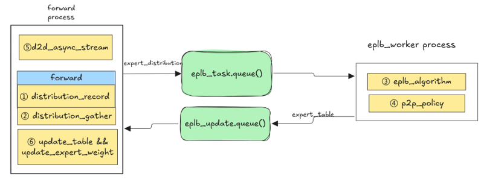

# Swift Balancer

## Overview
Experts rebalancing of MoE models for LLM serving is a mandatory option.Changing experts dynamically would have a negative impact on TTFT and TPOT while stop-the-world.
Asynchronously expert load balancing would be a better choice.
We have launched SwiftBalancer to support dynamic experts load balancing with Zero-overhead experts movement.

## Design

The overall workflow involves:
1. Record experts distribution during forward. We using expert_token_num after dispatch instead of topk_ids, thus we got much smaller tensor shape to reduce cost of hbm
   recording and add-operator.
2. Do all-gather for experts distribution. Using all-gather instead of all-reduce as less traffic volume.
3. Wake up eplb worker process with experts distribution when num_iterations comes. Run eplb algorithm in eplb worker.
4. Generate p2p send/recv ops and other operator such as log2phy would cost long cpu time.
5. Lanch ibatch_send_recv in async_stream before forward.
6. After forward, wait for the ibatch_send_recv finish, then do uapte expert map and expert weights.

In our profiling shows experts transforming is hidden in the bubble between forward iterations. Cpu time cost of eplb algo. and other python operator such as log2phy
would be hidden by eplb worker process too.

## Config Params

Currently swift balancer optimize 5ms TPOT with ep size 64 while cost less than 2ms for every layer expert movement.

We add new parameters for eplb:
"dynamic_eplb":true ---  enable dynamic eplb
"num_iterations_eplb_update": 400 -- forward iterations when eplb would begin
"gate_eplb":true -- eplb would update only once, false by default.
"num_wait_worker_iterations":30 -- forward iterations when eplb worker will finish cpu task. In our test default value 30 would cover most cases.
"expert_map_record_path" -- When dynamic eplb is completed, save the current expert load heatmap to the specified path.
"init_redundancy_expert" -- Specify redundant experts during initialization.

## Examples
### Dynamic eplb
Enable dynamic eplb and specify the trigger rounds.
--additional-config '{ "dynamic_eplb":true,"num_iterations_eplb_update":400, "gate_eplb":true, "num_wait_worker_iterations":30}'
### Record expert map for static eplb
Specify the path for the static eplb initialization file.
--additional-config '{ "expert_map_record_path": "/xx/xx.json", "init_redundancy_expert": 16, dynamic_eplb":true,"num_iterations_eplb_update":400, "gate_eplb":true, "num_wait_worker_iterations":30}'
### Static eplb
If expert map has been recorded, enable static eplb with expert map path.
--additional-config '{ "expert_map_path": "/xx/xx.json"}'
