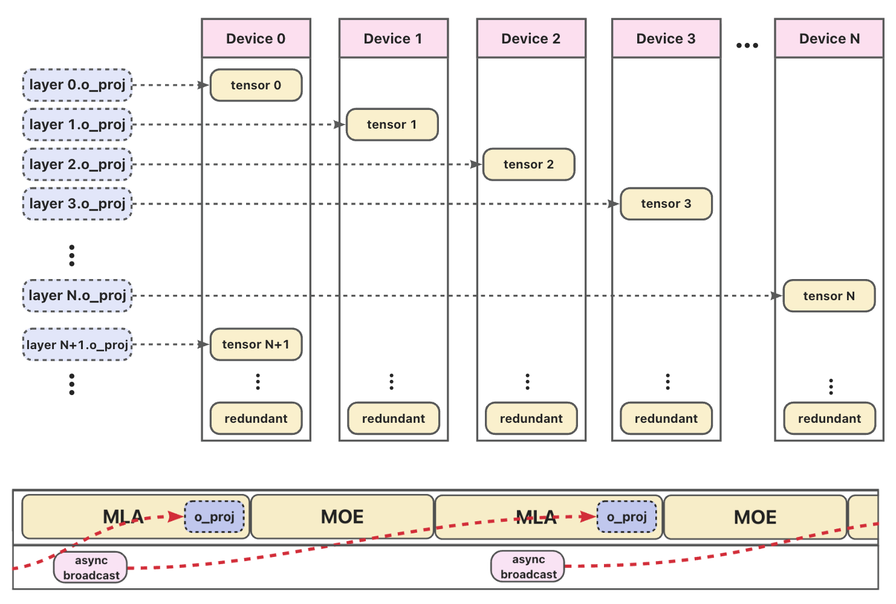

# Layer Sharding Linear Guide

## Overview

**Layer Shard Linear** is a memory-optimization feature designed for large language model (LLM) inference. It addresses the high memory pressure caused by **repeated linear operators across many layers** that share identical structure but have distinct weights.

Instead of replicating all weights on every device, **Layer Shard Linear shards the weights of a "series" of such operators across the NPU devices in a communication group**:
- The **i-th layer's linear weight** is stored **only on device `i % K`**, where `K` is the number of devices in the group.
- Other devices hold a lightweight **shared dummy tensor** during initialization and fetch the real weight **on-demand via asynchronous broadcast** during the forward pass.

As illustrated in the figure below, this design enables broadcast to reach weights: while the current layer (e.g., MLA or MOE) is being computed, the system **asynchronously broadcasts the next layer's weight** in the background. Because the attention computation in the MLA module is sufficiently latency-bound, the weight transfer for `o_proj` is **fully overlapped with computation**, making the communication **latency-free from the perspective of end-to-end inference**.

This approach **preserves exact computational semantics** while **significantly reducing NPU memory footprint**, especially critical for:
- Extremely deep architectures (e.g., DeepSeek-V3/R1 with 61 layers);
- Models using **[DSA-CP](https://github.com/vllm-project/vllm-ascend/pull/4702)** or **[FlashComm2](https://github.com/vllm-project/vllm-ascend/pull/4188)**, where the full `O` (output) projection matrix must reside in memory per layer;
- Scenarios where **attention computation latency fully overlaps** (hides) the communication cost of weight broadcasting.

---

### Flowchart


> **Figure.** Layer Shard Linear workflow: weights are sharded by layer across devices (top), and during forward execution (bottom), asynchronous broadcast pre-fetches the next layer's weight while the current layer computes—enabling zero-overhead weight loading.

---

## Getting Started

To enable **Layer Shard Linear**, specify the target linear layers using the `--additional-config` argument when launching your inference job. For example, to shard the `o_proj` and `q_b_proj` layers, use:

```bash
--additional-config '{
  "layer_sharding": ["o_proj", "q_b_proj"]
}'
```

---

## Supported Scenarios

This feature can be enabled in any scenario, but delivers the greatest benefit in the following cases:

### FlashComm2-enabled

When using [FlashComm2](https://github.com/vllm-project/vllm-ascend/pull/4188), the full output projection (`o_proj`) matrix must be resident in memory for each layer. Layer sharding significantly reduces memory pressure by distributing these weights across devices.

**Example configuration:**

```bash
export VLLM_ASCEND_FLASHCOMM2_PARALLEL_SIZE=1
vllm serve \
  --model DeepSeek-V3/R1 \
  --additional-config '{
    "layer_sharding": ["o_proj"]
  }'
```

### DSA-CP-enabled

With [DSA-CP](https://github.com/vllm-project/vllm-ascend/pull/4702), both `q_b_proj` and `o_proj` layers require large weight matrices to be stored per layer. Sharding these layers across NPUs helps fit extremely deep models (e.g., 61-layer architectures) into limited device memory.

**Example configuration:**

```bash
export VLLM_ASCEND_ENABLE_FLASHCOMM1=1
vllm serve \
  --model DeepSeek-V3.2 \
  --additional-config '{
    "layer_sharding": ["q_b_proj", "o_proj"]
  }'
``` 
