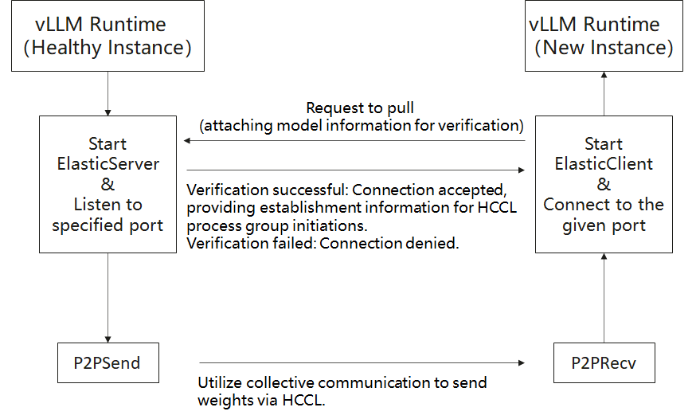
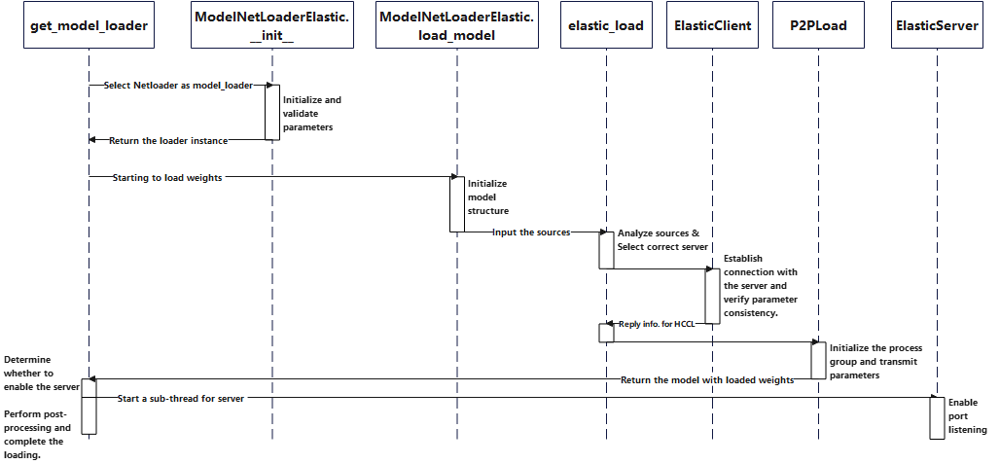

# Netloader Guide

This guide provides instructions for using **Netloader** as a weight-loader plugin for acceleration in **vLLM Ascend**.

---

## Overview

Netloader leverages high-bandwidth peer-to-peer (P2P) transfers between NPU cards to load model weights. It is implemented as a plugin (via the `register_model_loader` API added in vLLM 0.10). The workflow is:

1. A **server** preloads a model.  
2. A new **client** instance requests weight transfer.  
3. After validating that the model and partitioning match, the client uses HCCL collective communication (send/recv) to receive weights in the same order as stored in the model.

The server runs alongside normal inference tasks via sub-threads and via `stateless_init_torch_distributed_process_group` in vLLM. The client thus takes over weight initialization without needing to load from storage.

### Flowchart



### Timing Diagram



### Application Scenarios

- **Reduce startup latency**: By reusing already loaded weights and transferring them directly between NPU cards, Netloader cuts down model loading time vs conventional remote/local pull strategies.  
- **Relieve network & storage load**: Avoid repeated downloads of weight files from remote repositories, thus reducing pressure on central storage and network traffic.  
- **Improve resource utilization & lower cost**: Faster loading allows less reliance on standby compute nodes; resources can be scaled up/down more flexibly.  
- **Enhance business continuity & high availability**: In failure recovery, new instances can quickly take over without long downtime, improving system reliability and user experience.

---

## Usage

To enable Netloader, pass `--load-format=netloader` and provide configuration via `--model-loader-extra-config` (as a JSON string). Below are the supported configuration fields:

| Field Name         | Type    | Description                                                                                          | Allowed Values / Notes                                                                                       |
|--------------------|---------|------------------------------------------------------------------------------------------------------|--------------------------------------------------------------------------------------------------------------|
| **SOURCE**         | List    | Weighted data sources. Each item is a map with `device_id` and `sources`, specifying the rank and its endpoints (IP:port). <br>Example: `{"SOURCE": [{"device_id": 0, "sources": ["10.170.22.152:19374"]}, {"device_id": 1, "sources": ["10.170.22.152:11228"]}]}` <br>If omitted or empty, fallback to default loader. The SOURCE here is second priority. | A list of objects with keys `device_id: int` and `sources: List[str]` |
| **MODEL**           | String  | The model name, used to verify consistency between client and server.                                | Defaults to the `--model` argument if not specified.                                                         |
| **LISTEN_PORT**     | Integer | Base port for the server listener.                                                                   | The actual port = `LISTEN_PORT + RANK`. If omitted, a random valid port is chosen. Valid range: 1024–65535. If out of range, that server instance won’t open a listener. |
| **INT8_CACHE**      | String  | Behavior for handling int8 parameters in quantized models.                                           | One of `["hbm", "dram", "no"]`. <br> - `hbm`: copy original int8 parameters to high-bandwidth memory (HBM) (may cost a lot of HBM). <br> - `dram`: copy to DRAM. <br> - `no`: no special handling (may lead to divergence or unpredictable behavior). Default: `"no"`. |
| **INT8_CACHE_NAME** | List    | Names of parameters to which `INT8_CACHE` is applied (i.e. filtering).                               | Default: `None` (means no filtering—all parameters).                                                         |
| **OUTPUT_PREFIX**   | String  | Prefix for writing per-rank listener address/port files in server mode.                              | If set, each rank writes to `{OUTPUT_PREFIX}{RANK}.txt` (text), content = `IP:Port`.                         |
| **CONFIG_FILE**     | String  | Path to a JSON file specifying the above configuration.                                              | If provided, the SOURCE inside this file has **first priority** (overrides SOURCE in other configs).          |

---

## Example Commands & Placeholders

> Replace parts in `` `<...>` `` before running.

### Server

```shell
VLLM_SLEEP_WHEN_IDLE=1 vllm serve `<model_file>` \
  --tensor-parallel-size 1 \
  --served-model-name `<model_name>` \
  --enforce-eager \
  --port `<port>` \
  --load-format netloader
```

### Client

```shell
export NETLOADER_CONFIG='{"SOURCE":[{"device_id":0, "sources": ["`<server_IP>`:`<server_Port>`"]}]}'

VLLM_SLEEP_WHEN_IDLE=1 ASCEND_RT_VISIBLE_DEVICES=`<device_id_diff_from_server>` \
  vllm serve `<model_file>` \
  --tensor-parallel-size 1 \
  --served-model-name `<model_name>` \
  --enforce-eager \
  --port `<client_port>` \
  --load-format netloader \
  --model-loader-extra-config="${NETLOADER_CONFIG}"
```

#### Placeholder Descriptions

- `<model_file>`: Path to the model file  
- `<model_name>`: Model name (must match between server & client)  
- `<port>`: Base listening port on server  
- `<server_IP>` + `<server_Port>`: IP and port of the Netloader server (from server log)  
- `<device_id_diff_from_server>`: Client device ID (must differ from server’s)  
- `<client_port>`: Port on which client listens  

After startup, you can test consistency by issuing inference requests with temperature = 0 and comparing outputs.

---

## Note & Caveats

- If Netloader is used, **each worker process** must bind a listening port. That port may be user-specified or assigned randomly. If user-specified, ensure it is available.  
- Netloader requires extra HBM memory to establish HCCL connections (i.e. `HCCL_BUFFERSIZE`, default ~200 MB). Users should reserve sufficient capacity (e.g. via `--gpu-memory-utilization`).  
- It is recommended to set `VLLM_SLEEP_WHEN_IDLE=1` to mitigate unstable or slow connections/transmissions. Related info: [vLLM Issue #16660](https://github.com/vllm-project/vllm/issues/16660), [vLLM PR #16226](https://github.com/vllm-project/vllm/pull/16226).
