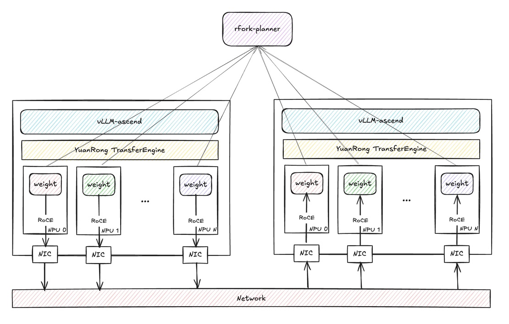

# RFork Guide

This guide explains how to use **RFork** as a model-loader plugin in **vLLM Ascend**.

---

## Overview

RFork is a warm-start weight loading path for vLLM Ascend. Instead of always reading model weights from storage, a new instance can request a compatible **seed** instance from an external planner, then pull weights directly from that seed through `YuanRong TransferEngine`.

The RFork loading flow in the current implementation is:

1. vLLM starts with `--load-format rfork`.
2. RFork builds a **seed key** from the model identity and deployment topology.
3. RFork asks the planner for an available seed matching that key.
4. If a seed is returned, the new instance initializes the model structure on its local NPU, registers local weight memory, fetches the remote transfer-engine metadata from the seed, and performs batch weight transfer into local parameter buffers.
5. If no seed is available, or any step fails, RFork cleans up and falls back to the default loader.
6. After the instance finishes loading, it starts a local seed service and periodically reports heartbeat to the planner, so later instances can reuse it.

## Flowchart



## Application Scenarios

- **Scale-out after a first successful load**: The first instance may still load from storage, but later instances with the same deployment identity can reuse it as a seed and shorten startup time.
- **Elastic serving clusters**: Because RFork asks a planner for available seeds, it fits clusters where instances are created and reclaimed dynamically.
- **Topology-sensitive deployments**: RFork encodes `kv_role`, `node_rank`, `tp_rank`, and optional `draft` role into the seed key, so only topology-compatible instances are matched together.

---

## Usage

To enable RFork, pass `--load-format rfork` and provide RFork settings through `--model-loader-extra-config` as a JSON string.

### RFork Prerequisites

- Install the runtime dependency `YuanRong TransferEngine` on every RFork instance.
- Run a planner service that implements the RFork seed protocol. A simple mock planner script is provided at [`rfork_planner.py`](../../../../examples/rfork/rfork_planner.py).

### Configuration Fields

| Field Name | Type | Description | Allowed Values / Notes |
|------------|------|-------------|------------------------|
| **model_url** | String | Logical model identifier used to build the RFork seed key. | Required for RFork transfer. Instances that should share seeds must use the same value. |
| **model_deploy_strategy_name** | String | Deployment strategy identifier used together with `model_url` to build the seed key. | Required for RFork transfer. Instances that should share seeds must use the same value. |
| **rfork_scheduler_url** | String | Base URL of the planner service used for seed allocation, release, and heartbeat. | Required for planner-based matching. Example: `http://127.0.0.1:1223`. |
| **rfork_seed_timeout_sec** | Number | Timeout for waiting until the local seed HTTP service becomes healthy after startup. | Optional. Default: `30`. Must be greater than `0`. |
| **rfork_seed_key_separator** | String | Separator used when building the RFork seed key string. | Optional. Default: `$`. Keep the same value across compatible instances. |

### How RFork Matches Seeds

RFork does not match instances by `model_url` alone. The local seed key is composed from:

- `model_url`
- `model_deploy_strategy_name`
- disaggregation mode derived from `kv_transfer_config.kv_role` or `kv_both`
- `node_rank`
- `tp_rank`
- optional `draft` suffix when the worker runs as a draft model

This means two instances must agree on both model identity and deployment topology before the planner will treat them as interchangeable seeds.

---

## Example Commands & Placeholders

> Replace parts in `` `<...>` `` before running.

### 1. Install YuanRong TransferEngine

```shell
pip install openyuanrong-transfer-engine
```

### 2. Start the Planner

A simple planner implementation is provided at [`rfork_planner.py`](../../../../examples/rfork/rfork_planner.py).

```shell
python rfork_planner.py \
  --host 0.0.0.0 \
  --port `<planner_port>`
```

### 3. Start vLLM Instances

Use the same RFork startup command for both the first instance and later instances in the same deployment.

For the first instance, the planner usually has no compatible seed yet, so RFork falls back to the default loader. After loading finishes, that instance starts its local seed service and reports itself to the planner.

For later instances, if the planner can allocate a compatible seed, RFork will try to transfer weights from the existing seed instance before falling back to the default loader.

```shell
export RFORK_CONFIG='{
  "model_url": "`<model_url>`",
  "model_deploy_strategy_name": "`<deploy_strategy>`",
  "rfork_scheduler_url": "http://`<planner_ip>`:`<planner_port>`"
}'

vllm serve `<model_path>` \
  --tensor-parallel-size 1 \
  --served-model-name `<served_model_name>` \
  --port `<port>` \
  --load-format rfork \
  --model-loader-extra-config "${RFORK_CONFIG}"
```

### Placeholder Descriptions

- `<model_path>`: Model path or model identifier passed to `vllm serve`.
- `<served_model_name>`: Service name exposed by vLLM.
- `<planner_ip>`: IP address or hostname of the RFork planner.
- `<planner_port>`: Listening port of the RFork planner.
- `<model_url>`: Stable model identity string used to build the RFork seed key.
- `<deploy_strategy>`: Stable deployment-strategy name used to build the RFork seed key.
- `<port>`: Serving port of the vLLM instance being started.

---

## Note & Caveats

- RFork requires `YuanRong TransferEngine` at runtime. If the package is missing, RFork cannot initialize the transfer backend.
- If RFORK is used, **each worker process** must bind a listening port. That port is assigned randomly.
- The example [`rfork_planner.py`](../../../../examples/rfork/rfork_planner.py) is only a simple mock implementation. If you need stronger scheduling, capacity management, or production-grade availability behavior, implement your own planner based on the RFork seed protocol.
